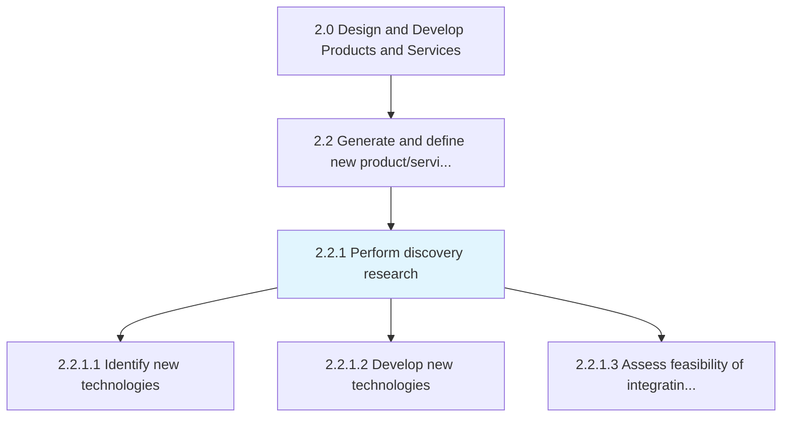
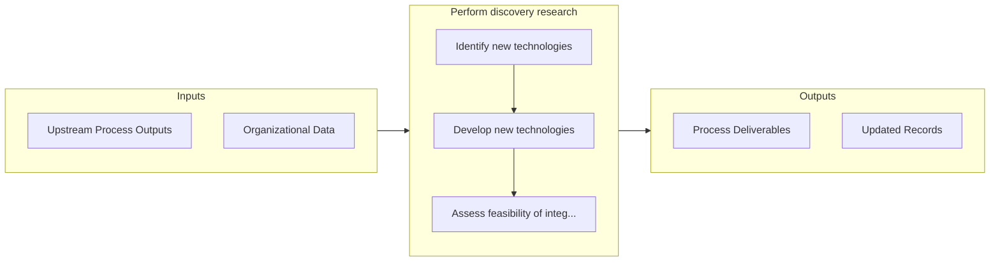

# Perform discovery research

> Coordinating R&D activity to identify new technologies to integrate into the revamped portfolio of products/services.

## Overview

Process 2.2.1 is a core process that defines the specific procedures for perform discovery research. 

Coordinating R&D activity to identify new technologies to integrate into the revamped portfolio of products/services. Conduct early-stage R&D activity to close gaps between existing solution offerings and changing market expectations. Triangulate appropriate technologies that can support the development of a revised product/service portfolio.

## Process Hierarchy



## Key Statistics

| Metric | Value |
|--------|-------|
| APQC Code | 10065 |
| Hierarchy ID | 2.2.1 |
| Level | Process |
| Parent | [2.2](../) |
| Sub-Processes | 3 |


## GraphDL Semantic Structure

```
perform.DiscoveryResearch
```

| Component | Value | Description |
|-----------|-------|-------------|
| Verb | `perform` | Primary action |
| Object | `discovery research` | Direct object |


## Process Flow



## Sub-Processes

| Process | Hierarchy ID | Description |
|---------|-------------|-------------|
| [Identify new technologies](./IdentifyNewTechnologies) | 2.2.1.1 | Determining new technologies to revise the portfolio of solution offerings |
| [Develop new technologies](./DevelopNewTechnologies) | 2.2.1.2 | Developing new technologies from scratch to integrate into a revised portfolio of solutions |
| [Assess feasibility of integrating new leading technologies into product/service concepts](./AssessFeasibilityOfIntegratingNewLeadingTechnologiesIntoProductserviceConcepts) | 2.2.1.3 | Appraising the feasibility of integrating new technologies, whether developed as a custom solution o |


## Related Concepts

- DiscoveryResearch


---

*Source: APQC PCF 10065 (2.2.1) - APQC*
