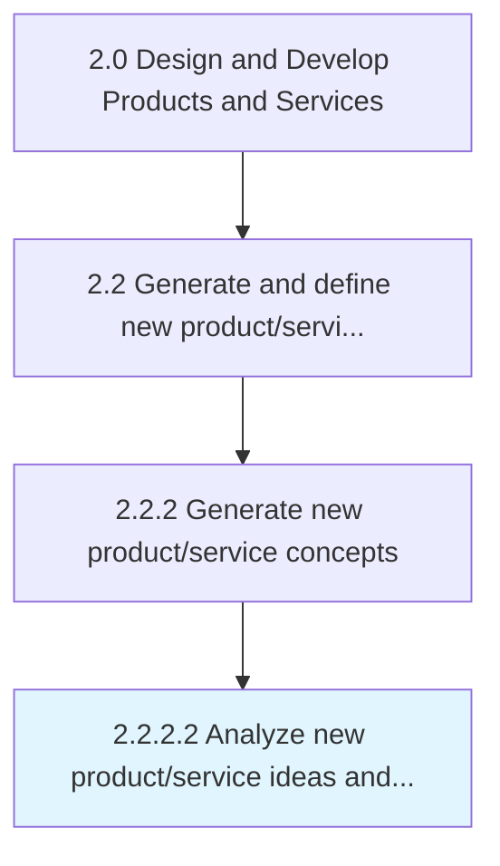

# Analyze new product/service ideas and requirements

> Assessing and reviewing the concepts and requirements of Generate and define new product/service ideas [19698].

## Overview

Activity 2.2.2.2 is an activity within the Design and Develop Products and Services framework. 

Assessing and reviewing the concepts and requirements of Generate and define new product/service ideas [19698]

## Process Hierarchy



## Key Statistics

| Metric | Value |
|--------|-------|
| APQC Code | 19987 |
| Hierarchy ID | 2.2.2.2 |
| Level | Activity |
| Parent | [2.2.2](../) |
| Sub-Processes | 0 |


## GraphDL Semantic Structure

```
analyze.NewProductserviceIdeasAndRequirements
```

| Component | Value | Description |
|-----------|-------|-------------|
| Verb | `analyze` | Primary action |
| Object | `new product/service ideas and requirements` | Direct object |


## Related Concepts

- [NewProductIdeas](/concepts/NewProductIdeas)
- [NewServiceIdeas](/concepts/NewServiceIdeas)
- [Requirements](/concepts/Requirements)


---

*Source: APQC PCF 19987 (2.2.2.2) - APQC*
