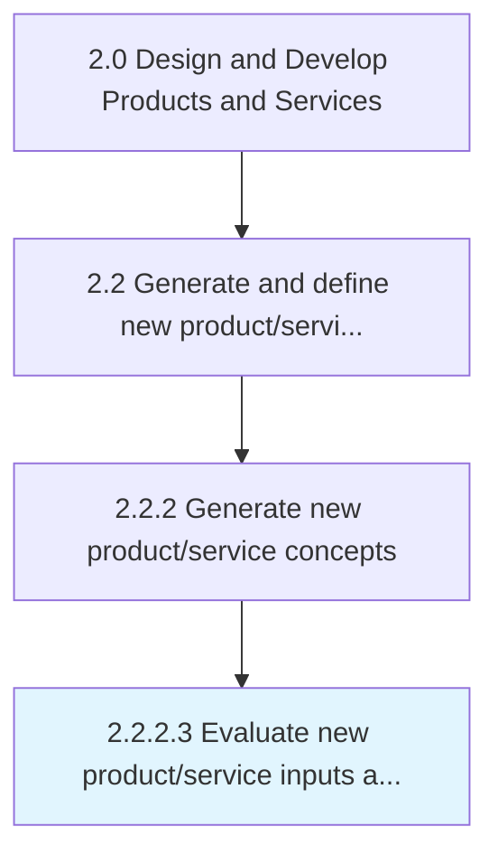
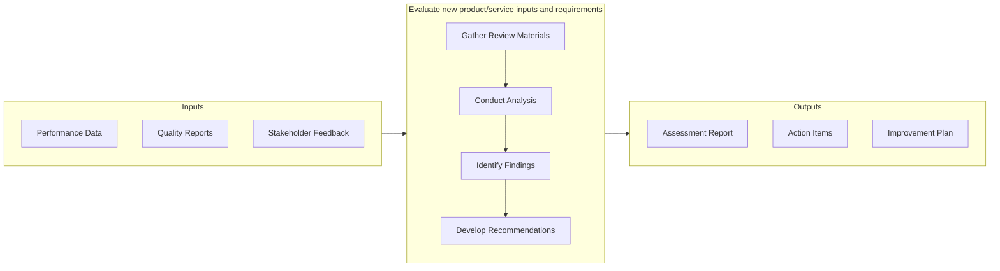

# Evaluate new product/service inputs and requirements

> Assessing and reviewing the required inputs and necessary elements such as automation, technology, hardware installation, regulatory requirements, certifications, etc.

## Overview

Activity 2.2.2.3 is an activity within the Design and Develop Products and Services framework. 

Assessing and reviewing the required inputs and necessary elements such as automation, technology, hardware installation, regulatory requirements, certifications, etc., for new products/services through defined process and analysis.

This activity contributes to the organization's product development objectives by executing defined processes within established quality and timeline parameters. It requires coordination across relevant functional teams and adherence to organizational standards. Outputs from this activity feed into downstream processes and contribute to overall product development success.

## Process Hierarchy



## Key Statistics

| Metric | Value |
|--------|-------|
| APQC Code | 19988 |
| Hierarchy ID | 2.2.2.3 |
| Level | Activity |
| Parent | [2.2.2](../) |
| Sub-Processes | 0 |


## GraphDL Semantic Structure

```graphdl
evaluate.NewProductserviceInputsAndRequirements
```

| Component | Value | Description |
|-----------|-------|-------------|
| Verb | `evaluate` | Primary action |
| Object | `new product/service inputs and requirements` | Direct object |


## Related Concepts

- NewProductInputs
- NewServiceInputs
- Requirements


## Process Flow



## RACI Matrix

| Activity | Responsible | Accountable | Consulted | Informed |
|----------|-------------|-------------|-----------|----------|
| Research and gather inputs | Market Research Analyst | Product Manager | Customer Success | Executive Team |
| Analyze and define requirements | Business Analyst | Product Manager | Engineering Lead | Design Team |
| Review and prioritize | Product Manager | VP of Product | Finance | Development Team |

## Related Occupations

- [Product Manager](/occupations/Management/ProductManagers) - Drives new product/service ideation and definition
- [Market Research Analyst](/occupations/BusinessAndFinancial/MarketResearchAnalysts) - Provides market insights for product concepts
- [UX Designer](/occupations/ArtsAndDesign/IndustrialDesigners) - Translates requirements into user experience designs
- [Business Analyst](/occupations/BusinessAndFinancial/ManagementAnalysts) - Analyzes and documents product requirements

## Related Departments

- Product Management - Leads concept generation and requirements definition
- Research & Development - Conducts discovery research and technology assessment
- [Marketing](/departments/Marketing) - Provides market intelligence and customer insights

## Industry Variations

### Manufacturing

Emphasizes physical product specifications, tooling requirements, and lean production principles in process execution.

### Technology

Focuses on agile development methodologies, continuous integration, and rapid iteration cycles with digital-first delivery.

### Healthcare

Requires adherence to patient safety standards, clinical efficacy validation, and comprehensive regulatory documentation.

## KPIs & Metrics

| Metric | Description | Target |
|--------|-------------|--------|
| Process Cycle Time | Average duration to complete this activity | < 10 business days |
| Completion Rate | Percentage of activities completed on schedule | > 90% |
| Stakeholder Satisfaction | Internal satisfaction score for process outputs | > 4.0/5.0 |

---

*Source: APQC PCF 19988 (2.2.2.3) - APQC*
