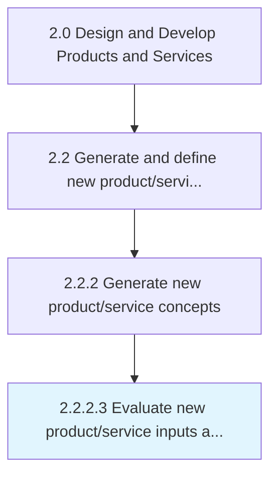

# Evaluate new product/service inputs and requirements

> Assessing and reviewing the required inputs and necessary elements such as automation, technology, hardware installation, regulatory requirements, certifications, etc.

## Overview

Activity 2.2.2.3 is an activity within the Design and Develop Products and Services framework. 

Assessing and reviewing the required inputs and necessary elements such as automation, technology, hardware installation, regulatory requirements, certifications, etc., for new products/services through defined process and analysis.

## Process Hierarchy



## Key Statistics

| Metric | Value |
|--------|-------|
| APQC Code | 19988 |
| Hierarchy ID | 2.2.2.3 |
| Level | Activity |
| Parent | [2.2.2](../) |
| Sub-Processes | 0 |


## GraphDL Semantic Structure

```
evaluate.NewProductserviceInputsAndRequirements
```

| Component | Value | Description |
|-----------|-------|-------------|
| Verb | `evaluate` | Primary action |
| Object | `new product/service inputs and requirements` | Direct object |


## Related Concepts

- [NewProductInputs](/concepts/NewProductInputs)
- [NewServiceInputs](/concepts/NewServiceInputs)
- [Requirements](/concepts/Requirements)


---

*Source: APQC PCF 19988 (2.2.2.3) - APQC*
