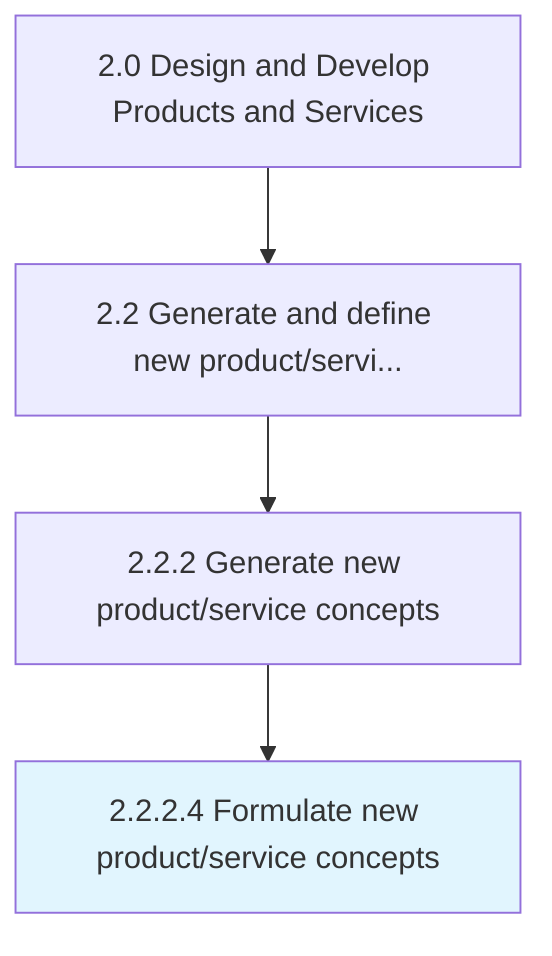

# Formulate new product/service concepts

> Devising ideas and elements necessary for thoughts on new product/service development.

## Overview

Activity 2.2.2.4 is an activity within the Design and Develop Products and Services framework. 

Devising ideas and elements necessary for thoughts on new product/service development.

## Process Hierarchy



## Key Statistics

| Metric | Value |
|--------|-------|
| APQC Code | 19989 |
| Hierarchy ID | 2.2.2.4 |
| Level | Activity |
| Parent | [2.2.2](../) |
| Sub-Processes | 0 |


## GraphDL Semantic Structure

```
formulate.NewProductserviceConcepts
```

| Component | Value | Description |
|-----------|-------|-------------|
| Verb | `formulate` | Primary action |
| Object | `new product/service concepts` | Direct object |


## Related Concepts

- NewProductConcepts
- NewServiceConcepts


---

*Source: APQC PCF 19989 (2.2.2.4) - APQC*
