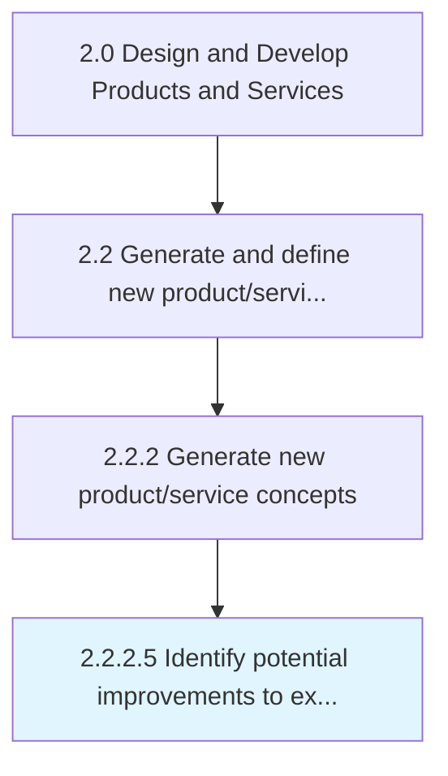
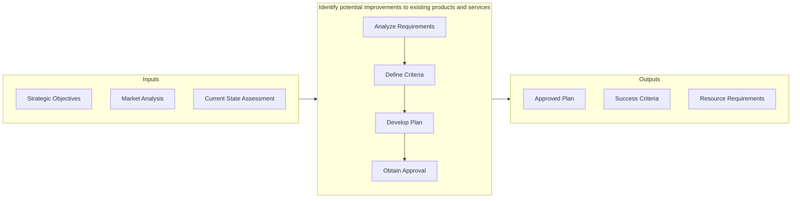
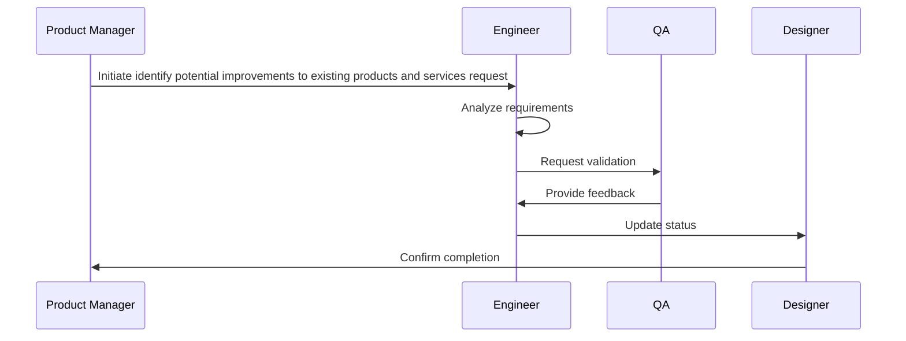

# Identify potential improvements to existing products and services

> Defining potential enhancements to current products/services in order to take advantage of a shift in market expectations.

## Overview

Activity 2.2.2.5 is an activity within the Design and Develop Products and Services framework. 

Defining potential enhancements to current products/services in order to take advantage of a shift in market expectations. Identify how the existing line of products/services may be revised--through enhancements to individual solutions or across-the-board renovations--in order to capitalize on present opportunities in the market.

This activity establishes the analytical foundation for informed decision-making by systematically collecting and evaluating relevant data from multiple sources. It involves structured methodologies for information gathering, stakeholder consultation, and synthesis of findings into actionable insights. The quality of outputs from this process directly impacts the effectiveness of downstream development activities.

## Process Hierarchy



## Key Statistics

| Metric | Value |
|--------|-------|
| APQC Code | 10068 |
| Hierarchy ID | 2.2.2.5 |
| Level | Activity |
| Parent | [2.2.2](../) |
| Sub-Processes | 0 |


## GraphDL Semantic Structure

```graphdl
identify.PotentialImprovements.to.ExistingProductsAndServices
```

| Component | Value | Description |
|-----------|-------|-------------|
| Verb | `identify` | Primary action |
| Object | `potential improvements` | Direct object |
| Preposition | `to` | Relationship |
| PrepObject | `existing products and services` | Indirect object |


## Related Concepts

- PotentialImprovements
- ExistingProducts
- PotentialImprovements
- Services


## Process Flow




## Process Sequence


## RACI Matrix

| Activity | Responsible | Accountable | Consulted | Informed |
|----------|-------------|-------------|-----------|----------|
| Research and gather inputs | Market Research Analyst | Product Manager | Customer Success | Executive Team |
| Analyze and define requirements | Business Analyst | Product Manager | Engineering Lead | Design Team |
| Review and prioritize | Product Manager | VP of Product | Finance | Development Team |

## Related Occupations

- [Product Manager](/occupations/Management/ProductManagers) - Drives new product/service ideation and definition
- [Market Research Analyst](/occupations/BusinessAndFinancial/MarketResearchAnalysts) - Provides market insights for product concepts
- [UX Designer](/occupations/ArtsAndDesign/IndustrialDesigners) - Translates requirements into user experience designs
- [Business Analyst](/occupations/BusinessAndFinancial/ManagementAnalysts) - Analyzes and documents product requirements

## Related Departments

- Product Management - Leads concept generation and requirements definition
- Research & Development - Conducts discovery research and technology assessment
- [Marketing](/departments/Marketing) - Provides market intelligence and customer insights

## Industry Variations

### Manufacturing

Emphasizes physical product specifications, tooling requirements, and lean production principles in process execution.

### Technology

Focuses on agile development methodologies, continuous integration, and rapid iteration cycles with digital-first delivery.

### Healthcare

Requires adherence to patient safety standards, clinical efficacy validation, and comprehensive regulatory documentation.

## KPIs & Metrics

| Metric | Description | Target |
|--------|-------------|--------|
| Process Cycle Time | Average duration to complete this activity | < 10 business days |
| Completion Rate | Percentage of activities completed on schedule | > 90% |
| Stakeholder Satisfaction | Internal satisfaction score for process outputs | > 4.0/5.0 |

---

*Source: APQC PCF 10068 (2.2.2.5) - APQC*
