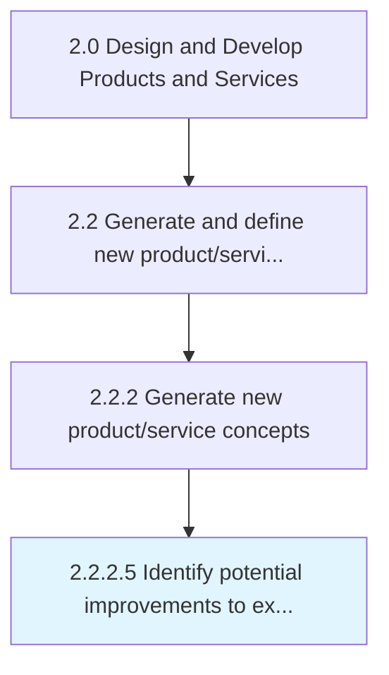

# Identify potential improvements to existing products and services

> Defining potential enhancements to current products/services in order to take advantage of a shift in market expectations.

## Overview

Activity 2.2.2.5 is an activity within the Design and Develop Products and Services framework. 

Defining potential enhancements to current products/services in order to take advantage of a shift in market expectations. Identify how the existing line of products/services may be revised--through enhancements to individual solutions or across-the-board renovations--in order to capitalize on present opportunities in the market.

## Process Hierarchy



## Key Statistics

| Metric | Value |
|--------|-------|
| APQC Code | 10068 |
| Hierarchy ID | 2.2.2.5 |
| Level | Activity |
| Parent | [2.2.2](../) |
| Sub-Processes | 0 |


## GraphDL Semantic Structure

```
identify.PotentialImprovements.to.ExistingProductsAndServices
```

| Component | Value | Description |
|-----------|-------|-------------|
| Verb | `identify` | Primary action |
| Object | `potential improvements` | Direct object |
| Preposition | `to` | Relationship |
| PrepObject | `existing products and services` | Indirect object |


## Related Concepts

- PotentialImprovements
- ExistingProducts
- PotentialImprovements
- Services


---

*Source: APQC PCF 10068 (2.2.2.5) - APQC*
