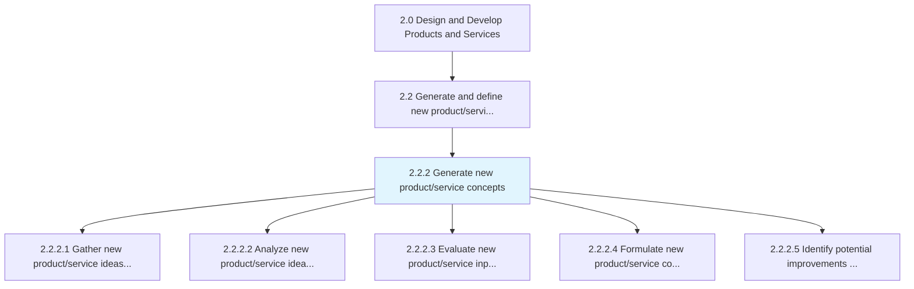
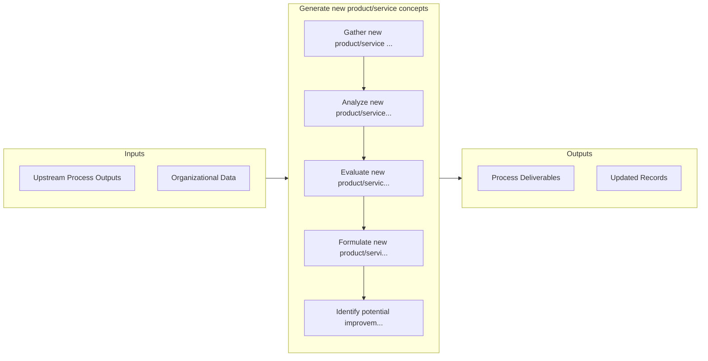

# Generate new product/service concepts

> Producing and defining ideologies for new product/service offerings.

## Overview

Process 2.2.2 is a core process that defines the specific procedures for generate new product/service concepts. 

Producing and defining ideologies for new product/service offerings.

## Process Hierarchy



## Key Statistics

| Metric | Value |
|--------|-------|
| APQC Code | 19669 |
| Hierarchy ID | 2.2.2 |
| Level | Process |
| Parent | [2.2](../) |
| Sub-Processes | 5 |


## GraphDL Semantic Structure

```
generate.NewProductserviceConcepts
```

| Component | Value | Description |
|-----------|-------|-------------|
| Verb | `generate` | Primary action |
| Object | `new product/service concepts` | Direct object |


## Process Flow



## Sub-Processes

| Process | Hierarchy ID | Description |
|---------|-------------|-------------|
| [Gather new product/service ideas and requirements](./GatherNewProductserviceIdeasAndRequirements) | 2.2.2.1 | Collecting necessary items, documents, regulatory requirements, etc |
| [Analyze new product/service ideas and requirements](./AnalyzeNewProductserviceIdeasAndRequirements) | 2.2.2.2 | Assessing and reviewing the concepts and requirements of Generate and define new product/service ide |
| [Evaluate new product/service inputs and requirements](./EvaluateNewProductserviceInputsAndRequirements) | 2.2.2.3 | Assessing and reviewing the required inputs and necessary elements such as automation, technology, h |
| [Formulate new product/service concepts](./FormulateNewProductserviceConcepts) | 2.2.2.4 | Devising ideas and elements necessary for thoughts on new product/service development |
| [Identify potential improvements to existing products and services](./IdentifyPotentialImprovementsToExistingProductsAndServices) | 2.2.2.5 | Defining potential enhancements to current products/services in order to take advantage of a shift i |


## Related Concepts

- [NewProductConcepts](/concepts/NewProductConcepts)
- [NewServiceConcepts](/concepts/NewServiceConcepts)


---

*Source: APQC PCF 19669 (2.2.2) - APQC*
