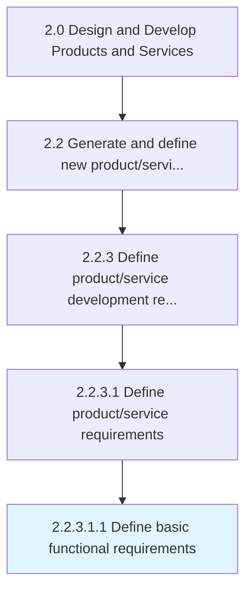

# Define basic functional requirements

> Determining the operations of functions related to the product/service in the marketing environment.

## Overview

Sub-Activity 2.2.3.1.1 is an activity within the Design and Develop Products and Services framework. 

Determining the operations of functions related to the product/service in the marketing environment.

## Process Hierarchy



## Key Statistics

| Metric | Value |
|--------|-------|
| APQC Code | 19991 |
| Hierarchy ID | 2.2.3.1.1 |
| Level | Sub-Activity |
| Parent | [2.2.3.1](../) |
| Sub-Processes | 0 |


## GraphDL Semantic Structure

```
define.BasicFunctionalRequirements
```

| Component | Value | Description |
|-----------|-------|-------------|
| Verb | `define` | Primary action |
| Object | `basic functional requirements` | Direct object |


## Related Concepts

- [BasicFunctionalRequirements](/concepts/BasicFunctionalRequirements)


---

*Source: APQC PCF 19991 (2.2.3.1.1) - APQC*
