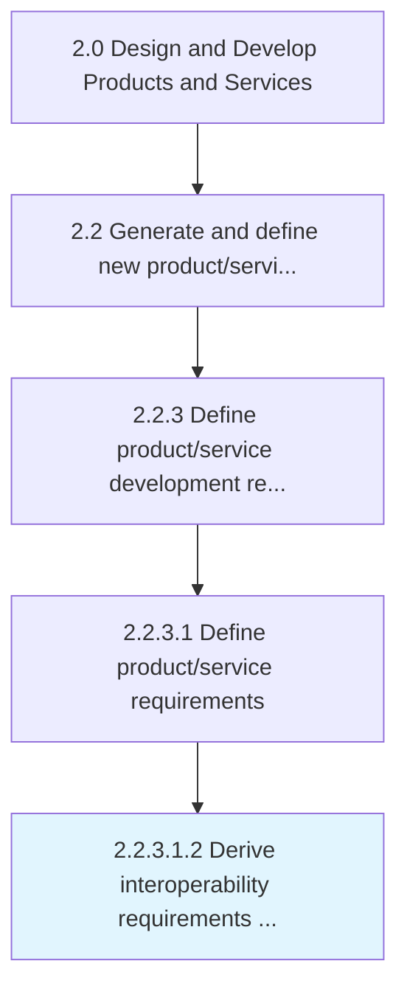

# Derive interoperability requirements for products and services

> Determining the ability of products and services to work together, exchange and use information in a multi-vendor, multi-network, and multi-service environment.

## Overview

Sub-Activity 2.2.3.1.2 is an activity within the Design and Develop Products and Services framework. 

Determining the ability of products and services to work together, exchange and use information in a multi-vendor, multi-network, and multi-service environment.

## Process Hierarchy



## Key Statistics

| Metric | Value |
|--------|-------|
| APQC Code | 16808 |
| Hierarchy ID | 2.2.3.1.2 |
| Level | Sub-Activity |
| Parent | [2.2.3.1](../) |
| Sub-Processes | 0 |


## GraphDL Semantic Structure

```
derive.InteroperabilityRequirements.for.ProductsAndServices
```

| Component | Value | Description |
|-----------|-------|-------------|
| Verb | `derive` | Primary action |
| Object | `interoperability requirements` | Direct object |
| Preposition | `for` | Relationship |
| PrepObject | `products and services` | Indirect object |


## Related Concepts

- [InteroperabilityRequirements](/concepts/InteroperabilityRequirements)
- [Products](/concepts/Products)
- [InteroperabilityRequirements](/concepts/InteroperabilityRequirements)
- [Services](/concepts/Services)


---

*Source: APQC PCF 16808 (2.2.3.1.2) - APQC*
