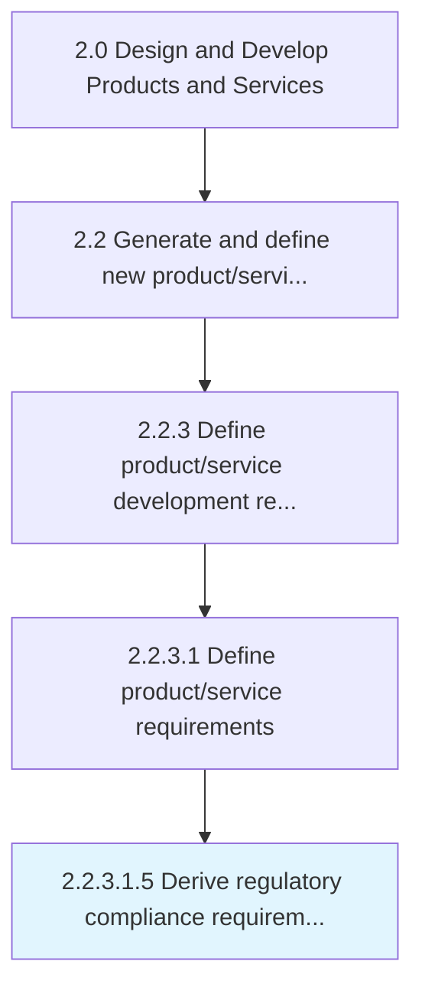

# Derive regulatory compliance requirements

> Meeting regulatory requirements set forth by such directives as RoHS, WEEE, ELV, and REACH.

## Overview

Sub-Activity 2.2.3.1.5 is an activity within the Design and Develop Products and Services framework. 

Meeting regulatory requirements set forth by such directives as RoHS, WEEE, ELV, and REACH.

## Process Hierarchy



## Key Statistics

| Metric | Value |
|--------|-------|
| APQC Code | 16811 |
| Hierarchy ID | 2.2.3.1.5 |
| Level | Sub-Activity |
| Parent | [2.2.3.1](../) |
| Sub-Processes | 0 |


## GraphDL Semantic Structure

```
derive.RegulatoryComplianceRequirements
```

| Component | Value | Description |
|-----------|-------|-------------|
| Verb | `derive` | Primary action |
| Object | `regulatory compliance requirements` | Direct object |


## Related Concepts

- [RegulatoryComplianceRequirements](/concepts/RegulatoryComplianceRequirements)


---

*Source: APQC PCF 16811 (2.2.3.1.5) - APQC*
