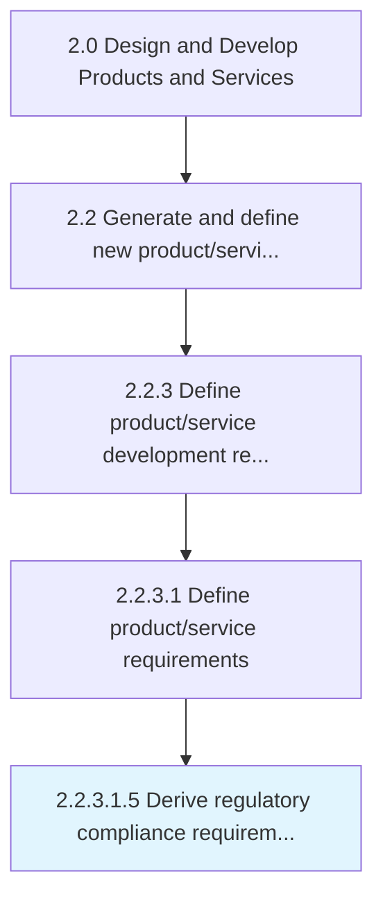
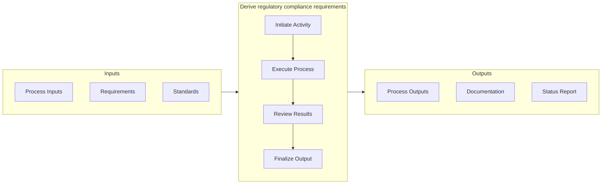

# Derive regulatory compliance requirements

> Meeting regulatory requirements set forth by such directives as RoHS, WEEE, ELV, and REACH.

## Overview

Sub-Activity 2.2.3.1.5 is an activity within the Design and Develop Products and Services framework. 

Meeting regulatory requirements set forth by such directives as RoHS, WEEE, ELV, and REACH.

This activity safeguards the organization's intellectual property and ensures adherence to all applicable regulatory frameworks. It involves systematic tracking of regulatory changes, coordination with legal counsel, and maintenance of comprehensive documentation for audit readiness. Failure to execute this process effectively can expose the organization to significant legal and financial risk.

## Process Hierarchy



## Key Statistics

| Metric | Value |
|--------|-------|
| APQC Code | 16811 |
| Hierarchy ID | 2.2.3.1.5 |
| Level | Sub-Activity |
| Parent | [2.2.3.1](../) |
| Sub-Processes | 0 |


## GraphDL Semantic Structure

```
derive.RegulatoryComplianceRequirements
```

| Component | Value | Description |
|-----------|-------|-------------|
| Verb | `derive` | Primary action |
| Object | `regulatory compliance requirements` | Direct object |


## Related Concepts

- RegulatoryComplianceRequirements


## Process Flow



## RACI Matrix

| Activity | Responsible | Accountable | Consulted | Informed |
|----------|-------------|-------------|-----------|----------|
| Research and gather inputs | Market Research Analyst | Product Manager | Customer Success | Executive Team |
| Analyze and define requirements | Business Analyst | Product Manager | Engineering Lead | Design Team |
| Review and prioritize | Product Manager | VP of Product | Finance | Development Team |

## Related Occupations

- [Product Manager](/occupations/Management/ProductManagers) - Drives new product/service ideation and definition
- [Market Research Analyst](/occupations/BusinessAndFinancial/MarketResearchAnalysts) - Provides market insights for product concepts
- [UX Designer](/occupations/ArtsAndDesign/IndustrialDesigners) - Translates requirements into user experience designs
- [Business Analyst](/occupations/BusinessAndFinancial/ManagementAnalysts) - Analyzes and documents product requirements

## Related Departments

- [Product Management](/departments/ProductManagement) - Leads concept generation and requirements definition
- [Research & Development](/departments/ResearchAndDevelopment) - Conducts discovery research and technology assessment
- [Marketing](/departments/Marketing) - Provides market intelligence and customer insights

## Industry Variations

### Life Sciences

Regulatory requirements are extensive, involving FDA submissions, clinical trial documentation, and ongoing pharmacovigilance compliance throughout the product lifecycle.

### Aerospace & Defense

Subject to strict government regulations (FAA, ITAR), requiring detailed certification processes, export controls, and defense acquisition compliance.

### Banking & Financial Services

Must comply with financial regulations (SOX, Basel III, Dodd-Frank), requiring extensive documentation and audit trails for all product changes.

## KPIs & Metrics

| Metric | Description | Target |
|--------|-------------|--------|
| Compliance Rate | Percentage of regulatory requirements met | 100% |
| Submission Cycle Time | Time from preparation to regulatory submission | < 30 days |
| Audit Finding Resolution | Time to resolve regulatory findings | < 15 days |

---

*Source: APQC PCF 16811 (2.2.3.1.5) - APQC*
