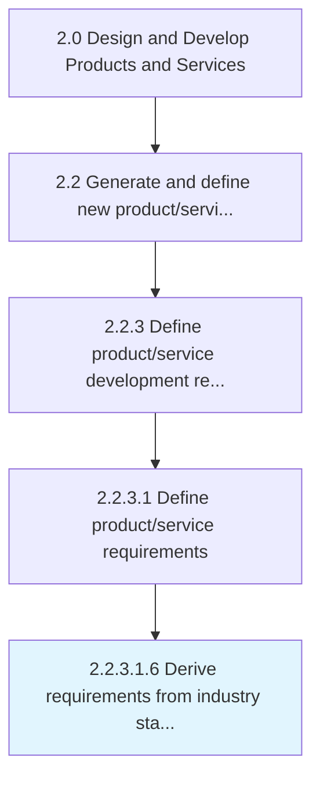

# Derive requirements from industry standards

> Complying with consumer electronic industry standards developed by the Consumer Technology Association (CTA).

## Overview

Sub-Activity 2.2.3.1.6 is an activity within the Design and Develop Products and Services framework. 

Complying with consumer electronic industry standards developed by the Consumer Technology Association (CTA).

## Process Hierarchy



## Key Statistics

| Metric | Value |
|--------|-------|
| APQC Code | 16812 |
| Hierarchy ID | 2.2.3.1.6 |
| Level | Sub-Activity |
| Parent | [2.2.3.1](../) |
| Sub-Processes | 0 |


## GraphDL Semantic Structure

```
derive.Requirements.from.IndustryStandards
```

| Component | Value | Description |
|-----------|-------|-------------|
| Verb | `derive` | Primary action |
| Object | `requirements` | Direct object |
| Preposition | `from` | Relationship |
| PrepObject | `industry standards` | Indirect object |


## Related Concepts

- Requirements
- IndustryStandards


---

*Source: APQC PCF 16812 (2.2.3.1.6) - APQC*
