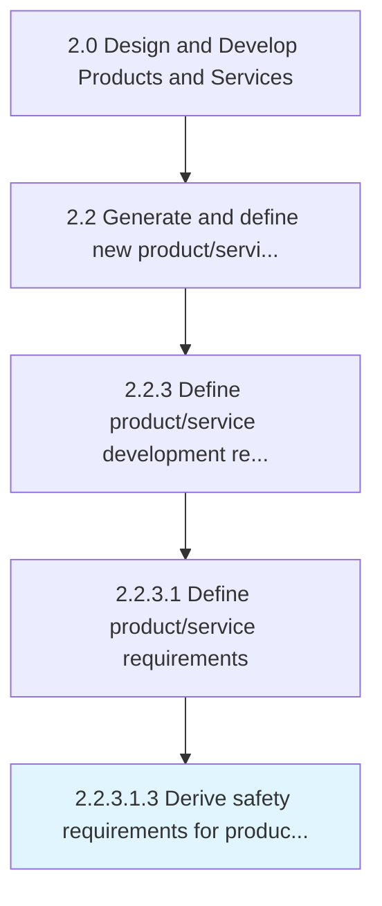

# Derive safety requirements for products and services

> Developing safety requirements in line with environmental safety, occupational health and safety, and community health and safety guidelines.

## Overview

Sub-Activity 2.2.3.1.3 is an activity within the Design and Develop Products and Services framework. 

Developing safety requirements in line with environmental safety, occupational health and safety, and community health and safety guidelines.

## Process Hierarchy



## Key Statistics

| Metric | Value |
|--------|-------|
| APQC Code | 16809 |
| Hierarchy ID | 2.2.3.1.3 |
| Level | Sub-Activity |
| Parent | [2.2.3.1](../) |
| Sub-Processes | 0 |


## GraphDL Semantic Structure

```
derive.SafetyRequirements.for.ProductsAndServices
```

| Component | Value | Description |
|-----------|-------|-------------|
| Verb | `derive` | Primary action |
| Object | `safety requirements` | Direct object |
| Preposition | `for` | Relationship |
| PrepObject | `products and services` | Indirect object |


## Related Concepts

- SafetyRequirements
- Products
- SafetyRequirements
- Services


---

*Source: APQC PCF 16809 (2.2.3.1.3) - APQC*
