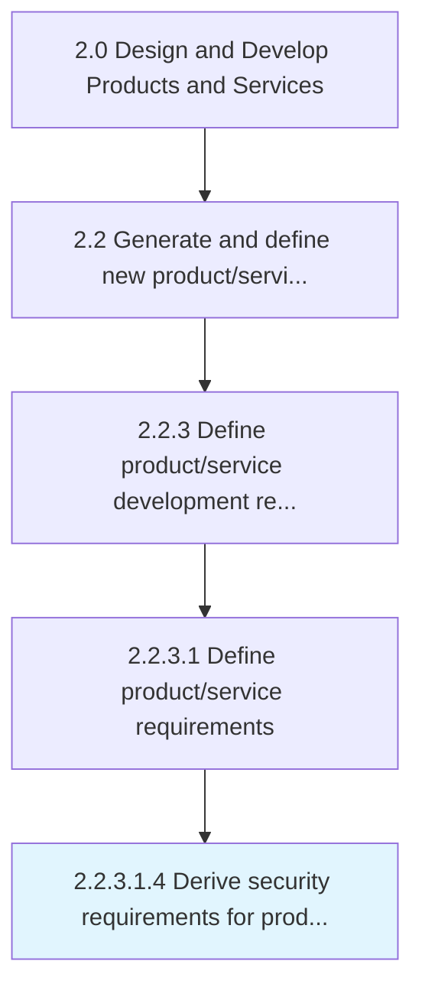

# Derive security requirements for products and services

> Implementing security requirements through authentication and encryption of CE device data stream.

## Overview

Sub-Activity 2.2.3.1.4 is an activity within the Design and Develop Products and Services framework. 

Implementing security requirements through authentication and encryption of CE device data stream. Utilize security measures such as cryptographic protocols and hardware security (smart cards).

## Process Hierarchy



## Key Statistics

| Metric | Value |
|--------|-------|
| APQC Code | 16810 |
| Hierarchy ID | 2.2.3.1.4 |
| Level | Sub-Activity |
| Parent | [2.2.3.1](../) |
| Sub-Processes | 0 |


## GraphDL Semantic Structure

```
derive.SecurityRequirements.for.ProductsAndServices
```

| Component | Value | Description |
|-----------|-------|-------------|
| Verb | `derive` | Primary action |
| Object | `security requirements` | Direct object |
| Preposition | `for` | Relationship |
| PrepObject | `products and services` | Indirect object |


## Related Concepts

- [SecurityRequirements](/concepts/SecurityRequirements)
- [Products](/concepts/Products)
- [SecurityRequirements](/concepts/SecurityRequirements)
- [Services](/concepts/Services)


---

*Source: APQC PCF 16810 (2.2.3.1.4) - APQC*
