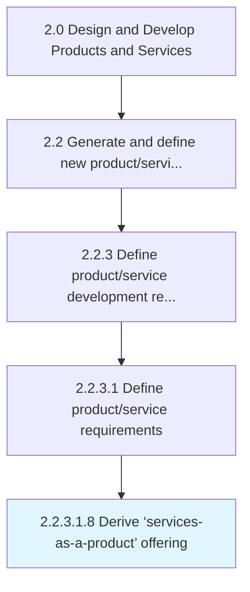

# Derive ‘services-as-a-product’ offering

> Productizing the service by defining the scope of the service/cost.

## Overview

Sub-Activity 2.2.3.1.8 is an activity within the Design and Develop Products and Services framework. 

Productizing the service by defining the scope of the service/cost. Target market for the service and make the service more tangible.

## Process Hierarchy



## Key Statistics

| Metric | Value |
|--------|-------|
| APQC Code | 16814 |
| Hierarchy ID | 2.2.3.1.8 |
| Level | Sub-Activity |
| Parent | [2.2.3.1](../) |
| Sub-Processes | 0 |


## GraphDL Semantic Structure

```
derive.ServicesasaproductOffering
```

| Component | Value | Description |
|-----------|-------|-------------|
| Verb | `derive` | Primary action |
| Object | `‘services-as-a-product’ offering` | Direct object |


---

*Source: APQC PCF 16814 (2.2.3.1.8) - APQC*
