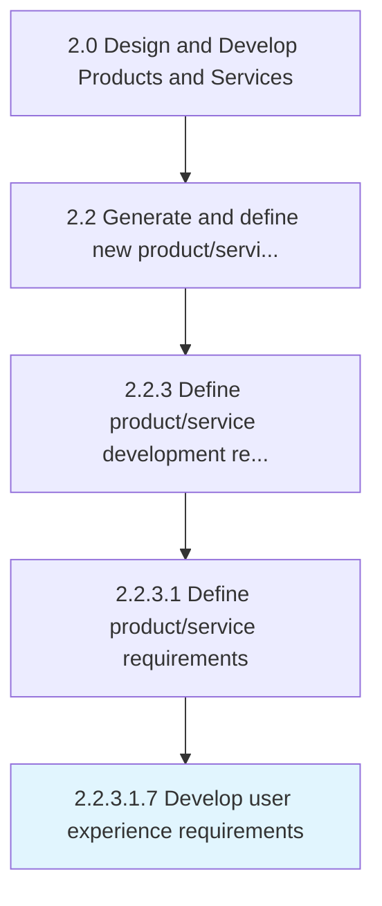

# Develop user experience requirements

> Identifying and creating steps and tools to develop the user experience.

## Overview

Sub-Activity 2.2.3.1.7 is an activity within the Design and Develop Products and Services framework. 

Identifying and creating steps and tools to develop the user experience.

## Process Hierarchy



## Key Statistics

| Metric | Value |
|--------|-------|
| APQC Code | 19992 |
| Hierarchy ID | 2.2.3.1.7 |
| Level | Sub-Activity |
| Parent | [2.2.3.1](../) |
| Sub-Processes | 0 |


## GraphDL Semantic Structure

```
develop.UserExperienceRequirements
```

| Component | Value | Description |
|-----------|-------|-------------|
| Verb | `develop` | Primary action |
| Object | `user experience requirements` | Direct object |


## Related Concepts

- UserExperienceRequirements


---

*Source: APQC PCF 19992 (2.2.3.1.7) - APQC*
