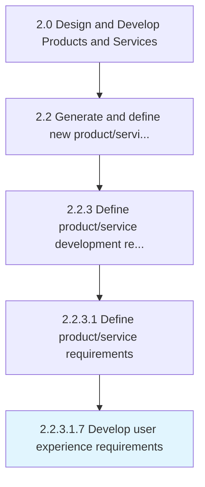
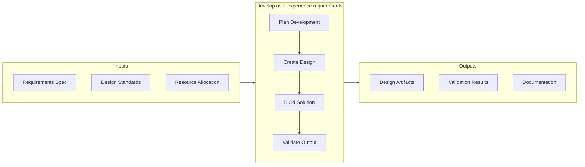

# Develop user experience requirements

> Identifying and creating steps and tools to develop the user experience.

## Overview

Sub-Activity 2.2.3.1.7 is an activity within the Design and Develop Products and Services framework. 

Identifying and creating steps and tools to develop the user experience.

This activity contributes to the organization's product development objectives by executing defined processes within established quality and timeline parameters. It requires coordination across relevant functional teams and adherence to organizational standards. Outputs from this activity feed into downstream processes and contribute to overall product development success.

## Process Hierarchy



## Key Statistics

| Metric | Value |
|--------|-------|
| APQC Code | 19992 |
| Hierarchy ID | 2.2.3.1.7 |
| Level | Sub-Activity |
| Parent | [2.2.3.1](../) |
| Sub-Processes | 0 |


## GraphDL Semantic Structure

```
develop.UserExperienceRequirements
```

| Component | Value | Description |
|-----------|-------|-------------|
| Verb | `develop` | Primary action |
| Object | `user experience requirements` | Direct object |


## Related Concepts

- UserExperienceRequirements


## Process Flow



## RACI Matrix

| Activity | Responsible | Accountable | Consulted | Informed |
|----------|-------------|-------------|-----------|----------|
| Research and gather inputs | Market Research Analyst | Product Manager | Customer Success | Executive Team |
| Analyze and define requirements | Business Analyst | Product Manager | Engineering Lead | Design Team |
| Review and prioritize | Product Manager | VP of Product | Finance | Development Team |

## Related Occupations

- [Product Manager](/occupations/Management/ProductManagers) - Drives new product/service ideation and definition
- [Market Research Analyst](/occupations/BusinessAndFinancial/MarketResearchAnalysts) - Provides market insights for product concepts
- [UX Designer](/occupations/ArtsAndDesign/IndustrialDesigners) - Translates requirements into user experience designs
- [Business Analyst](/occupations/BusinessAndFinancial/ManagementAnalysts) - Analyzes and documents product requirements

## Related Departments

- [Product Management](/departments/ProductManagement) - Leads concept generation and requirements definition
- [Research & Development](/departments/ResearchAndDevelopment) - Conducts discovery research and technology assessment
- [Marketing](/departments/Marketing) - Provides market intelligence and customer insights

## Industry Variations

### Manufacturing

Emphasizes physical product specifications, tooling requirements, and lean production principles in process execution.

### Technology

Focuses on agile development methodologies, continuous integration, and rapid iteration cycles with digital-first delivery.

### Healthcare

Requires adherence to patient safety standards, clinical efficacy validation, and comprehensive regulatory documentation.

## KPIs & Metrics

| Metric | Description | Target |
|--------|-------------|--------|
| Time to Prototype | Duration from concept approval to working prototype | < 30 days |
| Design Iteration Count | Number of design revisions before approval | < 3 iterations |
| Specification Compliance | Percentage of design specs met by prototype | > 95% |

---

*Source: APQC PCF 19992 (2.2.3.1.7) - APQC*
