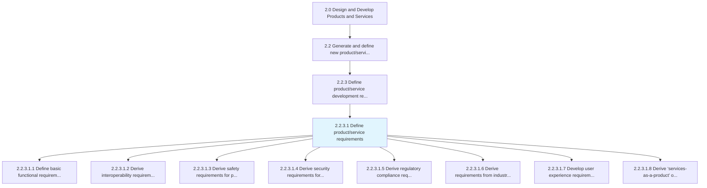
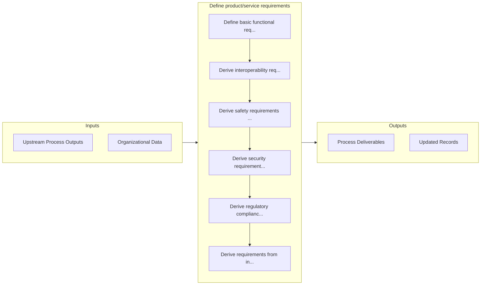

# Define product/service requirements

> Determining requirements related to the creation of the product/service.

## Overview

Activity 2.2.3.1 is an activity within the Design and Develop Products and Services framework. 

Determining requirements related to the creation of the product/service. Explain potential achievements that could be made.

## Process Hierarchy



## Key Statistics

| Metric | Value |
|--------|-------|
| APQC Code | 11331 |
| Hierarchy ID | 2.2.3.1 |
| Level | Activity |
| Parent | [2.2.3](../) |
| Sub-Processes | 8 |


## GraphDL Semantic Structure

```
define.ProductserviceRequirements
```

| Component | Value | Description |
|-----------|-------|-------------|
| Verb | `define` | Primary action |
| Object | `product/service requirements` | Direct object |


## Process Flow



## Sub-Processes

| Process | Hierarchy ID | Description |
|---------|-------------|-------------|
| [Define basic functional requirements](./DefineBasicFunctionalRequirements) | 2.2.3.1.1 | Determining the operations of functions related to the product/service in the marketing environment |
| [Derive interoperability requirements for products and services](./DeriveInteroperabilityRequirementsForProductsAndServices) | 2.2.3.1.2 | Determining the ability of products and services to work together, exchange and use information in a |
| [Derive safety requirements for products and services](./DeriveSafetyRequirementsForProductsAndServices) | 2.2.3.1.3 | Developing safety requirements in line with environmental safety, occupational health and safety, an |
| [Derive security requirements for products and services](./DeriveSecurityRequirementsForProductsAndServices) | 2.2.3.1.4 | Implementing security requirements through authentication and encryption of CE device data stream |
| [Derive regulatory compliance requirements](./DeriveRegulatoryComplianceRequirements) | 2.2.3.1.5 | Meeting regulatory requirements set forth by such directives as RoHS, WEEE, ELV, and REACH |
| [Derive requirements from industry standards](./DeriveRequirementsFromIndustryStandards) | 2.2.3.1.6 | Complying with consumer electronic industry standards developed by the Consumer Technology Associati |
| [Develop user experience requirements](./DevelopUserExperienceRequirements) | 2.2.3.1.7 | Identifying and creating steps and tools to develop the user experience |
| [Derive ‘services-as-a-product’ offering](./DeriveServicesasaproductOffering) | 2.2.3.1.8 | Productizing the service by defining the scope of the service/cost |


## Related Concepts

- ProductRequirements
- ServiceRequirements


---

*Source: APQC PCF 11331 (2.2.3.1) - APQC*
