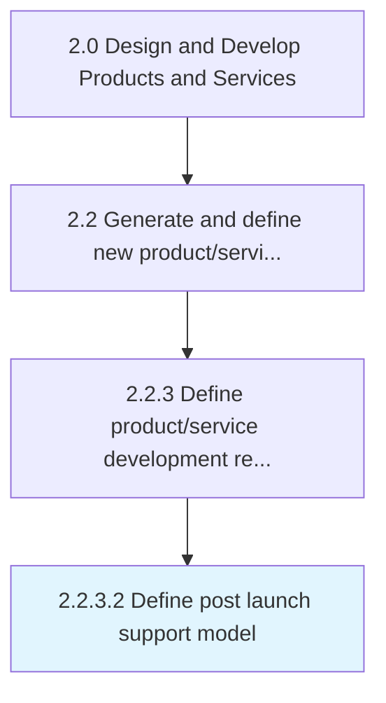

# Define post launch support model

> Defining SLAs (Service Level Agreement) and service level KPIs (Key Performance Indicator).

## Overview

Activity 2.2.3.2 is an activity within the Design and Develop Products and Services framework. 

Defining SLAs (Service Level Agreement) and service level KPIs (Key Performance Indicator).

## Process Hierarchy



## Key Statistics

| Metric | Value |
|--------|-------|
| APQC Code | 16815 |
| Hierarchy ID | 2.2.3.2 |
| Level | Activity |
| Parent | [2.2.3](../) |
| Sub-Processes | 0 |


## GraphDL Semantic Structure

```
define.PostLaunchSupportModel
```

| Component | Value | Description |
|-----------|-------|-------------|
| Verb | `define` | Primary action |
| Object | `post launch support model` | Direct object |


## Related Concepts

- [PostLaunchSupportModel](/concepts/PostLaunchSupportModel)


---

*Source: APQC PCF 16815 (2.2.3.2) - APQC*
