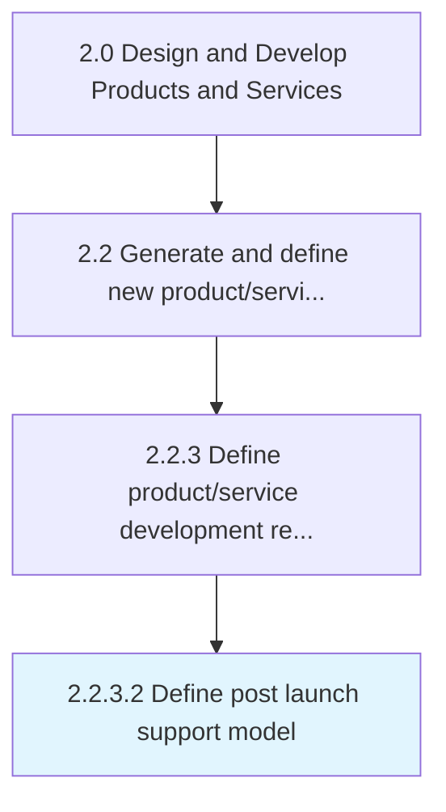
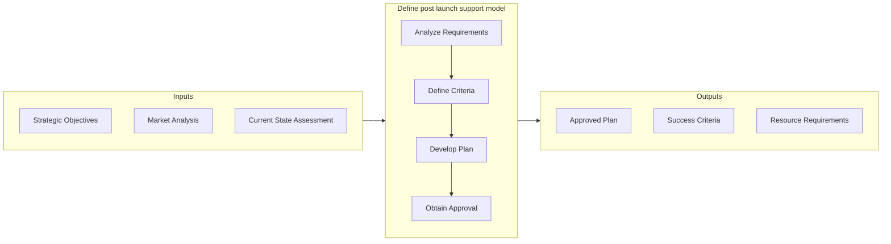

# Define post launch support model

> Defining SLAs (Service Level Agreement) and service level KPIs (Key Performance Indicator).

## Overview

Activity 2.2.3.2 is an activity within the Design and Develop Products and Services framework. 

Defining SLAs (Service Level Agreement) and service level KPIs (Key Performance Indicator).

This activity bridges the gap between product development and commercial availability by validating market readiness and executing go-to-market strategies. It requires coordination across product, marketing, sales, and operations teams to ensure a successful introduction. Key considerations include competitive positioning, channel readiness, and customer communication planning.

## Process Hierarchy



## Key Statistics

| Metric | Value |
|--------|-------|
| APQC Code | 16815 |
| Hierarchy ID | 2.2.3.2 |
| Level | Activity |
| Parent | [2.2.3](../) |
| Sub-Processes | 0 |


## GraphDL Semantic Structure

```
define.PostLaunchSupportModel
```

| Component | Value | Description |
|-----------|-------|-------------|
| Verb | `define` | Primary action |
| Object | `post launch support model` | Direct object |


## Related Concepts

- PostLaunchSupportModel


## Process Flow



## RACI Matrix

| Activity | Responsible | Accountable | Consulted | Informed |
|----------|-------------|-------------|-----------|----------|
| Research and gather inputs | Market Research Analyst | Product Manager | Customer Success | Executive Team |
| Analyze and define requirements | Business Analyst | Product Manager | Engineering Lead | Design Team |
| Review and prioritize | Product Manager | VP of Product | Finance | Development Team |

## Related Occupations

- [Product Manager](/occupations/Management/ProductManagers) - Drives new product/service ideation and definition
- [Market Research Analyst](/occupations/BusinessAndFinancial/MarketResearchAnalysts) - Provides market insights for product concepts
- [UX Designer](/occupations/ArtsAndDesign/IndustrialDesigners) - Translates requirements into user experience designs
- [Business Analyst](/occupations/BusinessAndFinancial/ManagementAnalysts) - Analyzes and documents product requirements

## Related Departments

- [Product Management](/departments/ProductManagement) - Leads concept generation and requirements definition
- [Research & Development](/departments/ResearchAndDevelopment) - Conducts discovery research and technology assessment
- [Marketing](/departments/Marketing) - Provides market intelligence and customer insights

## Industry Variations

### Retail

Market testing focuses on consumer behavior analysis, seasonal demand patterns, and omnichannel launch readiness across physical and digital storefronts.

### Consumer Products

Extensive focus group testing, packaging evaluation, and shelf-placement strategy drive market introduction decisions.

### Technology

Beta programs, early adopter feedback loops, and agile launch iterations with continuous deployment characterize the market introduction approach.

## KPIs & Metrics

| Metric | Description | Target |
|--------|-------------|--------|
| Time to Market | Duration from concept to market availability | Per product roadmap |
| Launch Success Rate | Percentage of launches meeting revenue targets | > 70% |
| Customer Adoption Rate | New customer uptake within first quarter | > 15% |

---

*Source: APQC PCF 16815 (2.2.3.2) - APQC*
