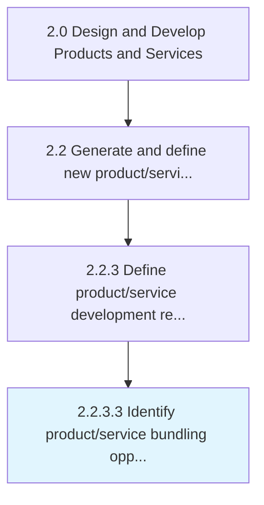

# Identify product/service bundling opportunities

> Establishing areas of growth and further development of product/service mix, customization, market based changes, etc.

## Overview

Activity 2.2.3.3 is an activity within the Design and Develop Products and Services framework. 

Establishing areas of growth and further development of product/service mix, customization, market based changes, etc., to further demonstrate value to the customer in the competition.

## Process Hierarchy



## Key Statistics

| Metric | Value |
|--------|-------|
| APQC Code | 17389 |
| Hierarchy ID | 2.2.3.3 |
| Level | Activity |
| Parent | [2.2.3](../) |
| Sub-Processes | 0 |


## GraphDL Semantic Structure

```
identify.ProductserviceBundlingOpportunities
```

| Component | Value | Description |
|-----------|-------|-------------|
| Verb | `identify` | Primary action |
| Object | `product/service bundling opportunities` | Direct object |


## Related Concepts

- ProductBundlingOpportunities
- ServiceBundlingOpportunities


---

*Source: APQC PCF 17389 (2.2.3.3) - APQC*
