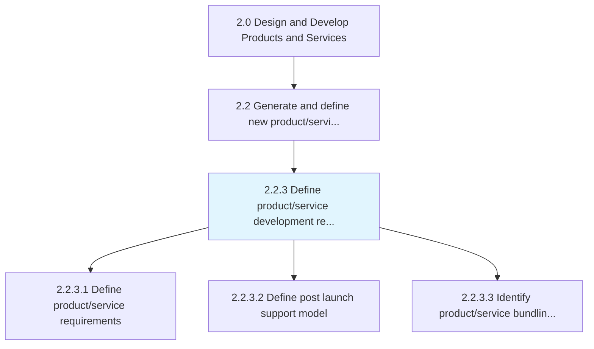
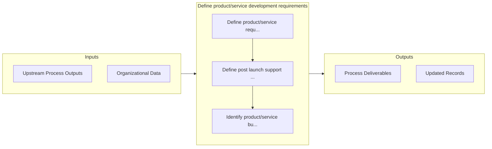

# Define product/service development requirements

> Encompassing the identification and capture of new product/service requirements or potential improvements to current products/services.

## Overview

Process 2.2.3 is a core process that defines the specific procedures for define product/service development requirements. 

Encompassing the identification and capture of new product/service requirements or potential improvements to current products/services. Collaborating with members of the supply chain to ensure the feasibility of what is being defined in the requirements. For example, a product with manufacturing requirements that supply chain cannot currently fulfill requires a corporate decision to either upgrade manufacturing capabilities or abandon the new product. Enterprise-level effects and needs must be considered. Depending on the nature of the final product or service, these requirements are often defined as a set of abilities, such as availability or reliability, that influence product development decisions.

## Process Hierarchy



## Key Statistics

| Metric | Value |
|--------|-------|
| APQC Code | 19990 |
| Hierarchy ID | 2.2.3 |
| Level | Process |
| Parent | [2.2](../) |
| Sub-Processes | 3 |


## GraphDL Semantic Structure

```graphdl
define.ProductserviceDevelopmentRequirements
```

| Component | Value | Description |
|-----------|-------|-------------|
| Verb | `define` | Primary action |
| Object | `product/service development requirements` | Direct object |


## Process Flow



## Sub-Processes

| Process | Hierarchy ID | Description |
|---------|-------------|-------------|
| [Define product/service requirements](./2.2.3.1-DefineProductserviceRequirements/) | 2.2.3.1 | Determining requirements related to the creation of the product/service |
| [Define post launch support model](./DefinePostLaunchSupportModel) | 2.2.3.2 | Defining SLAs (Service Level Agreement) and service level KPIs (Key Performance Indicator) |
| [Identify product/service bundling opportunities](./IdentifyProductserviceBundlingOpportunities) | 2.2.3.3 | Establishing areas of growth and further development of product/service mix, customization, market b |


## Related Concepts

- ProductDevelopmentRequirements
- ServiceDevelopmentRequirements


---

*Source: APQC PCF 19990 (2.2.3) - APQC*
