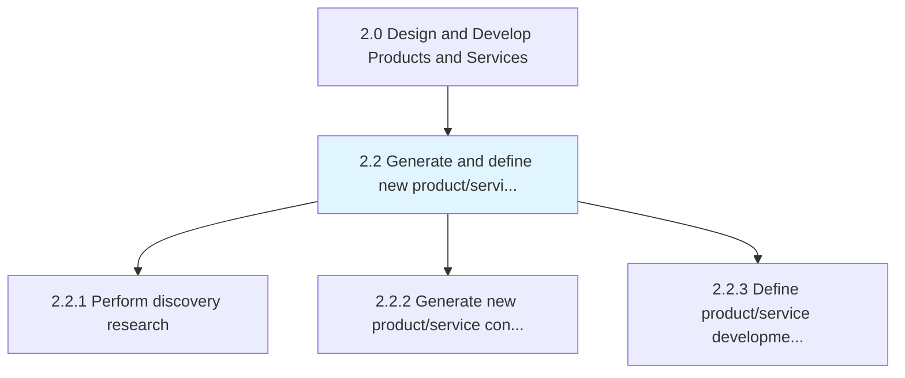
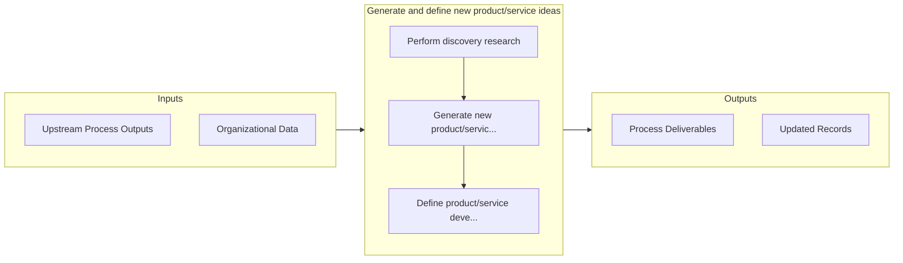

# Generate and define new product/service ideas

> Identifying and describing new product or service thoughts based on organizational objectives/targets.

## Overview

Group 2.2 is a process group within APQC Category 2.0 (Design and Develop Products and Services). 

Identifying and describing new product or service thoughts based on organizational objectives/targets.

## Process Hierarchy



## Key Statistics

| Metric | Value |
|--------|-------|
| APQC Code | 19698 |
| Hierarchy ID | 2.2 |
| Level | Group |
| Parent | [2](../) |
| Sub-Processes | 3 |


## GraphDL Semantic Structure

```
generate.AndDefineNewProductserviceIdeas
```

| Component | Value | Description |
|-----------|-------|-------------|
| Verb | `generate` | Primary action |
| Object | `and define new product/service ideas` | Direct object |


## Process Flow



## Sub-Processes

| Process | Hierarchy ID | Description |
|---------|-------------|-------------|
| [Perform discovery research](./2.2.1-PerformDiscoveryResearch/) | 2.2.1 | Coordinating R&D activity to identify new technologies to integrate into the revamped portfolio of p |
| [Generate new product/service concepts](./2.2.2-GenerateNewProductserviceConcepts/) | 2.2.2 | Producing and defining ideologies for new product/service offerings |
| [Define product/service development requirements](./2.2.3-DefineProductserviceDevelopmentRequirements/) | 2.2.3 | Encompassing the identification and capture of new product/service requirements or potential improve |


## Related Concepts

- [NewProductIdeas](/concepts/NewProductIdeas)
- [NewServiceIdeas](/concepts/NewServiceIdeas)
- [NewProductIdeas](/concepts/NewProductIdeas)
- [NewServiceIdeas](/concepts/NewServiceIdeas)


---

*Source: APQC PCF 19698 (2.2) - APQC*
