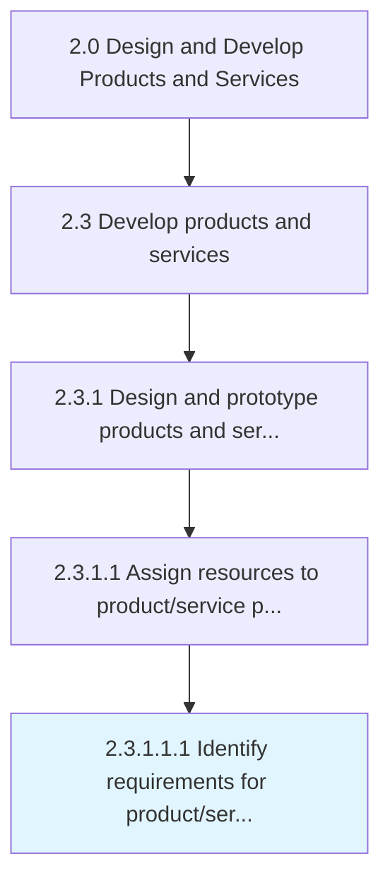

# Identify requirements for product/service design/development partners

> Determining essential elements for collaborators involved in blueprint/development of product/service.

## Overview

Sub-Activity 2.3.1.1.1 is an activity within the Design and Develop Products and Services framework. 

Determining essential elements for collaborators involved in blueprint/development of product/service.

## Process Hierarchy



## Key Statistics

| Metric | Value |
|--------|-------|
| APQC Code | 19994 |
| Hierarchy ID | 2.3.1.1.1 |
| Level | Sub-Activity |
| Parent | [2.3.1.1](../) |
| Sub-Processes | 0 |


## GraphDL Semantic Structure

```
identify.Requirements.for.ProductserviceDesigndevelopmentPartners
```

| Component | Value | Description |
|-----------|-------|-------------|
| Verb | `identify` | Primary action |
| Object | `requirements` | Direct object |
| Preposition | `for` | Relationship |
| PrepObject | `product/service design/development partners` | Indirect object |


## Related Concepts

- Requirements
- ProductPartners
- Requirements
- ServiceDesignPartners
- Requirements
- DevelopmentPartners


---

*Source: APQC PCF 19994 (2.3.1.1.1) - APQC*
