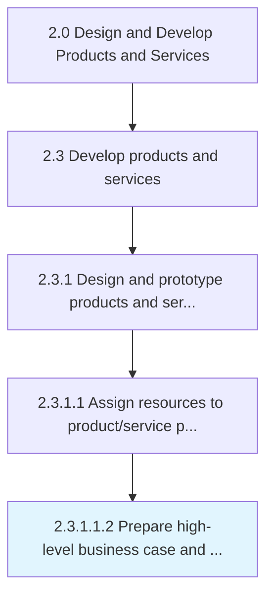

# Prepare high-level business case and technical assessment

> Preparing a business-level business case and a technical feasibility assessment in order to move the product/service projects forward.

## Overview

Sub-Activity 2.3.1.1.2 is an activity within the Design and Develop Products and Services framework. 

Preparing a business-level business case and a technical feasibility assessment in order to move the product/service projects forward. Weigh the costs and benefits of designing, developing, and evaluating the shortlisted product/service concepts. Prepare a business case to justify the product/service projects. Conduct a technical appraisal to ensure that the organization has the technical know-how and resources to further develop these concepts.

## Process Hierarchy



## Key Statistics

| Metric | Value |
|--------|-------|
| APQC Code | 10084 |
| Hierarchy ID | 2.3.1.1.2 |
| Level | Sub-Activity |
| Parent | [2.3.1.1](../) |
| Sub-Processes | 0 |


## GraphDL Semantic Structure

```
prepare.HighlevelBusinessCaseAndTechnicalAssessment
```

| Component | Value | Description |
|-----------|-------|-------------|
| Verb | `prepare` | Primary action |
| Object | `high-level business case and technical assessment` | Direct object |


---

*Source: APQC PCF 10084 (2.3.1.1.2) - APQC*
