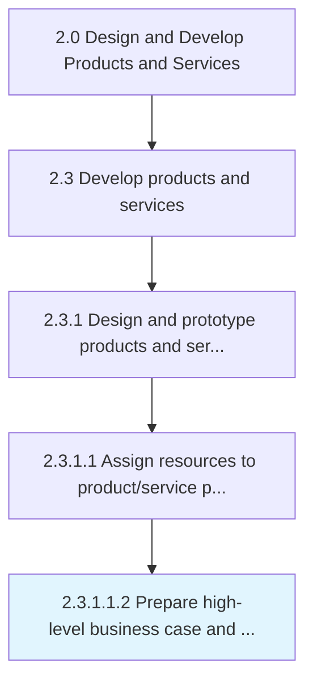
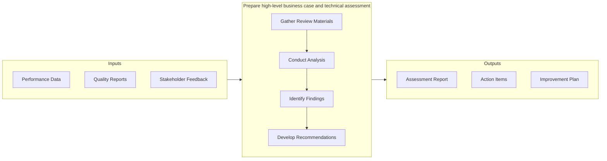

# Prepare high-level business case and technical assessment

> Preparing a business-level business case and a technical feasibility assessment in order to move the product/service projects forward.

## Overview

Sub-Activity 2.3.1.1.2 is an activity within the Design and Develop Products and Services framework. 

Preparing a business-level business case and a technical feasibility assessment in order to move the product/service projects forward. Weigh the costs and benefits of designing, developing, and evaluating the shortlisted product/service concepts. Prepare a business case to justify the product/service projects. Conduct a technical appraisal to ensure that the organization has the technical know-how and resources to further develop these concepts.

This activity contributes to the organization's product development objectives by executing defined processes within established quality and timeline parameters. It requires coordination across relevant functional teams and adherence to organizational standards. Outputs from this activity feed into downstream processes and contribute to overall product development success.

## Process Hierarchy



## Key Statistics

| Metric | Value |
|--------|-------|
| APQC Code | 10084 |
| Hierarchy ID | 2.3.1.1.2 |
| Level | Sub-Activity |
| Parent | [2.3.1.1](../) |
| Sub-Processes | 0 |


## GraphDL Semantic Structure

```graphdl
prepare.HighlevelBusinessCaseAndTechnicalAssessment
```

| Component | Value | Description |
|-----------|-------|-------------|
| Verb | `prepare` | Primary action |
| Object | `high-level business case and technical assessment` | Direct object |


## Process Flow



## RACI Matrix

| Activity | Responsible | Accountable | Consulted | Informed |
|----------|-------------|-------------|-----------|----------|
| Design and develop | Engineering Team | Engineering Manager | Product Manager | Quality Assurance |
| Test and validate | QA Engineer | Quality Manager | Product Designer | Product Manager |
| Approve and release | Engineering Manager | VP of Engineering | Operations | All Stakeholders |

## Related Occupations

- [Product Designer](/occupations/ArtsAndDesign/IndustrialDesigners) - Designs and prototypes product solutions
- [Engineering Manager](/occupations/Management/IndustrialProductionManagers) - Oversees development and production readiness
- [Quality Engineer](/occupations/Architecture/IndustrialEngineers) - Validates quality and reliability of prototypes
- [Supply Chain Analyst](/occupations/BusinessAndFinancial/LogisticsAnalysts) - Evaluates production and delivery feasibility

## Related Departments

- [Engineering](/departments/Technology) - Designs, prototypes, and validates products
- [Operations](/departments/Operations) - Prepares production and service delivery processes
- Quality Assurance - Tests and validates product quality

## Industry Variations

### Manufacturing

Emphasizes physical product specifications, tooling requirements, and lean production principles in process execution.

### Technology

Focuses on agile development methodologies, continuous integration, and rapid iteration cycles with digital-first delivery.

### Healthcare

Requires adherence to patient safety standards, clinical efficacy validation, and comprehensive regulatory documentation.

## KPIs & Metrics

| Metric | Description | Target |
|--------|-------------|--------|
| Process Cycle Time | Average duration to complete this activity | < 10 business days |
| Completion Rate | Percentage of activities completed on schedule | > 90% |
| Stakeholder Satisfaction | Internal satisfaction score for process outputs | > 4.0/5.0 |

---

*Source: APQC PCF 10084 (2.3.1.1.2) - APQC*
