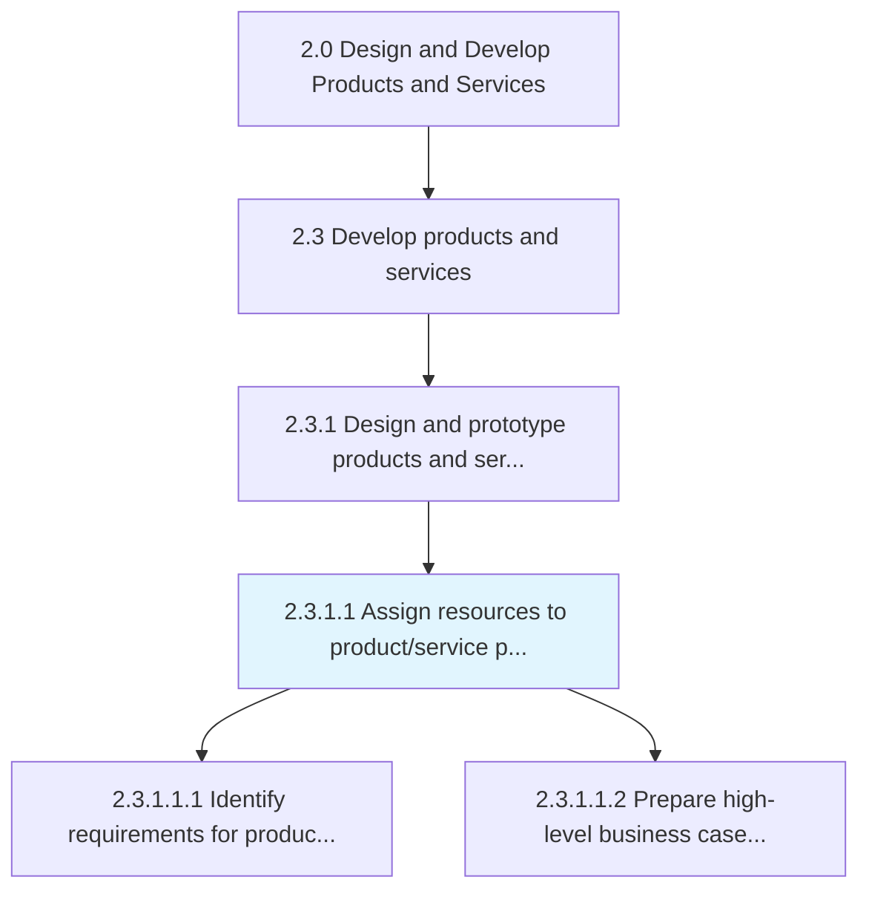
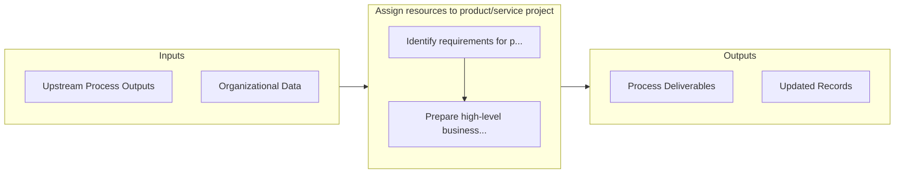

# Assign resources to product/service project

> Allocating resources to the design, development, and evaluation of product/service concepts.

## Overview

Activity 2.3.1.1 is an activity within the Design and Develop Products and Services framework. 

Allocating resources to the design, development, and evaluation of product/service concepts. Allocate funds, personnel, and time for developing the new and/or revised products/services. Begin to design the potential new product/service concepts that have been prioritized and selected for further development.

## Process Hierarchy



## Key Statistics

| Metric | Value |
|--------|-------|
| APQC Code | 10083 |
| Hierarchy ID | 2.3.1.1 |
| Level | Activity |
| Parent | [2.3.1](../) |
| Sub-Processes | 2 |


## GraphDL Semantic Structure

```graphdl
assign.Resources.to.ProductserviceProject
```

| Component | Value | Description |
|-----------|-------|-------------|
| Verb | `assign` | Primary action |
| Object | `resources` | Direct object |
| Preposition | `to` | Relationship |
| PrepObject | `product/service project` | Indirect object |


## Process Flow



## Sub-Processes

| Process | Hierarchy ID | Description |
|---------|-------------|-------------|
| [Identify requirements for product/service design/development partners](./IdentifyRequirementsForProductserviceDesigndevelopmentPartners) | 2.3.1.1.1 | Determining essential elements for collaborators involved in blueprint/development of product/servic |
| [Prepare high-level business case and technical assessment](./PrepareHighlevelBusinessCaseAndTechnicalAssessment) | 2.3.1.1.2 | Preparing a business-level business case and a technical feasibility assessment in order to move the |


## Related Concepts

- Resources
- ProductProject
- Resources
- ServiceProject


---

*Source: APQC PCF 10083 (2.3.1.1) - APQC*
