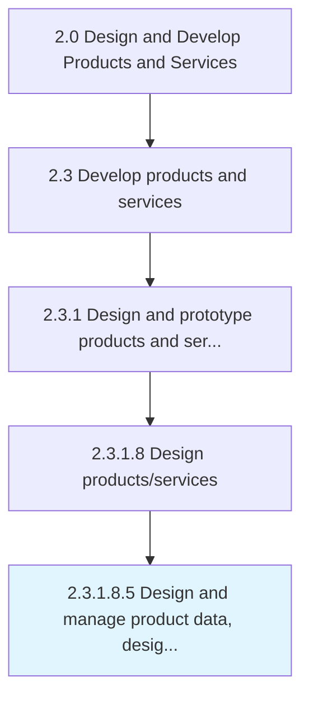

# Design and manage product data, design, and bill of materials

> Designing the BOM-Bill of material, manufacturing BOM and Service BOMA bill of materials list for all the raw materials and components/parts used in the producing end product.

## Overview

Sub-Activity 2.3.1.8.5 is an activity within the Design and Develop Products and Services framework. 

Designing the BOM-Bill of material, manufacturing BOM and Service BOMA bill of materials list for all the raw materials and components/parts used in the producing end product.

## Process Hierarchy



## Key Statistics

| Metric | Value |
|--------|-------|
| APQC Code | 16818 |
| Hierarchy ID | 2.3.1.8.5 |
| Level | Sub-Activity |
| Parent | [2.3.1.8](../) |
| Sub-Processes | 0 |


## GraphDL Semantic Structure

```
design.AndManageProductDataDesignAndBill.of.Materials
```

| Component | Value | Description |
|-----------|-------|-------------|
| Verb | `design` | Primary action |
| Object | `and manage product data, design, and bill` | Direct object |
| Preposition | `of` | Relationship |
| PrepObject | `materials` | Indirect object |


## Related Concepts

- ProductData
- Materials
- Design
- Materials
- Bill
- Materials
- ProductData
- Materials
- Design
- Materials


---

*Source: APQC PCF 16818 (2.3.1.8.5) - APQC*
