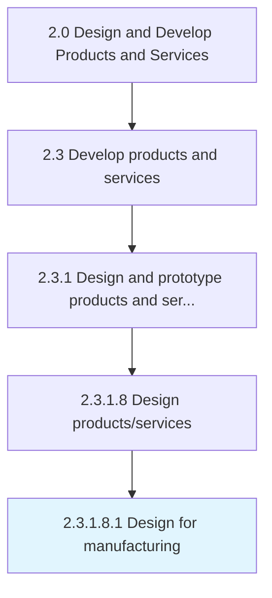

# Design for manufacturing

> Carrying out the steps necessary to appropriately manufacture correct parts.

## Overview

Sub-Activity 2.3.1.8.1 is an activity within the Design and Develop Products and Services framework. 

Carrying out the steps necessary to appropriately manufacture correct parts. This includes designing application, product hardware, mold, casting, mechanical, and electrical aspects of the product.

## Process Hierarchy



## Key Statistics

| Metric | Value |
|--------|-------|
| APQC Code | 16819 |
| Hierarchy ID | 2.3.1.8.1 |
| Level | Sub-Activity |
| Parent | [2.3.1.8](../) |
| Sub-Processes | 0 |


## GraphDL Semantic Structure

```
design.ForManufacturing
```

| Component | Value | Description |
|-----------|-------|-------------|
| Verb | `design` | Primary action |
| Object | `for manufacturing` | Direct object |


## Related Concepts

- [Manufacturing](/concepts/Manufacturing)


---

*Source: APQC PCF 16819 (2.3.1.8.1) - APQC*
