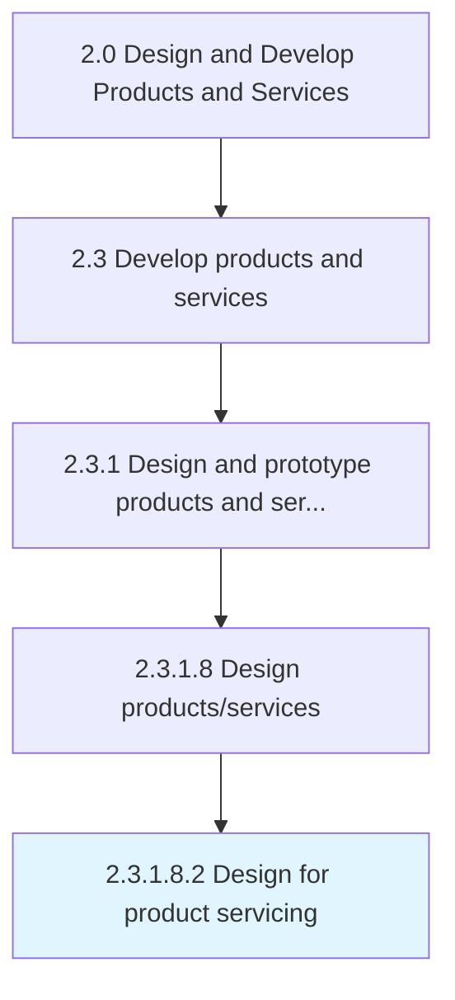

# Design for product servicing

> Creating product application service view to allow for product servicing and refurbishing.

## Overview

Sub-Activity 2.3.1.8.2 is an activity within the Design and Develop Products and Services framework. 

Creating product application service view to allow for product servicing and refurbishing.

## Process Hierarchy



## Key Statistics

| Metric | Value |
|--------|-------|
| APQC Code | 16820 |
| Hierarchy ID | 2.3.1.8.2 |
| Level | Sub-Activity |
| Parent | [2.3.1.8](../) |
| Sub-Processes | 0 |


## GraphDL Semantic Structure

```
design.ForProductServicing
```

| Component | Value | Description |
|-----------|-------|-------------|
| Verb | `design` | Primary action |
| Object | `for product servicing` | Direct object |


## Related Concepts

- [ProductServicing](/concepts/ProductServicing)


---

*Source: APQC PCF 16820 (2.3.1.8.2) - APQC*
