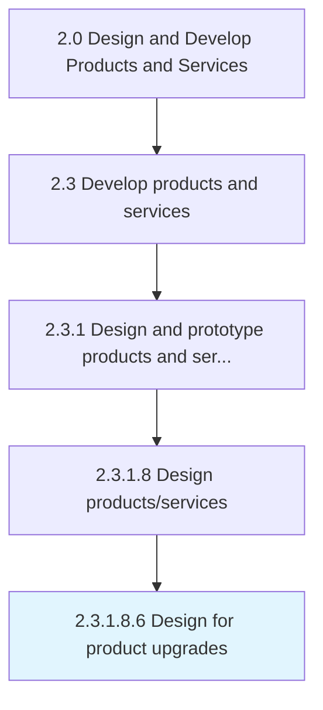

# Design for product upgrades

> Designing hardware and software upgrade techniques.

## Overview

Sub-Activity 2.3.1.8.6 is an activity within the Design and Develop Products and Services framework. 

Designing hardware and software upgrade techniques.

## Process Hierarchy



## Key Statistics

| Metric | Value |
|--------|-------|
| APQC Code | 16823 |
| Hierarchy ID | 2.3.1.8.6 |
| Level | Sub-Activity |
| Parent | [2.3.1.8](../) |
| Sub-Processes | 0 |


## GraphDL Semantic Structure

```
design.ForProductUpgrades
```

| Component | Value | Description |
|-----------|-------|-------------|
| Verb | `design` | Primary action |
| Object | `for product upgrades` | Direct object |


## Related Concepts

- [ProductUpgrades](/concepts/ProductUpgrades)


---

*Source: APQC PCF 16823 (2.3.1.8.6) - APQC*
