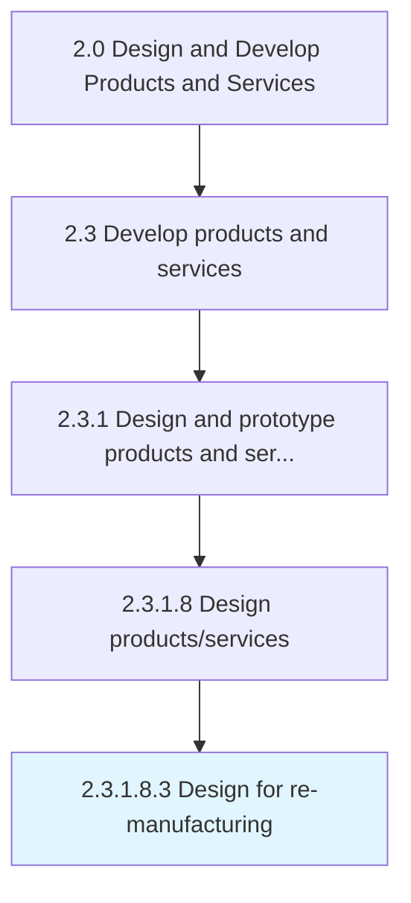

# Design for re-manufacturing

> Replacing core components and republishing.

## Overview

Sub-Activity 2.3.1.8.3 is an activity within the Design and Develop Products and Services framework. 

## Process Hierarchy



## Key Statistics

| Metric | Value |
|--------|-------|
| APQC Code | 16821 |
| Hierarchy ID | 2.3.1.8.3 |
| Level | Sub-Activity |
| Parent | [2.3.1.8](../) |
| Sub-Processes | 0 |


## GraphDL Semantic Structure

```
design.ForRemanufacturing
```

| Component | Value | Description |
|-----------|-------|-------------|
| Verb | `design` | Primary action |
| Object | `for re-manufacturing` | Direct object |


---

*Source: APQC PCF 16821 (2.3.1.8.3) - APQC*
