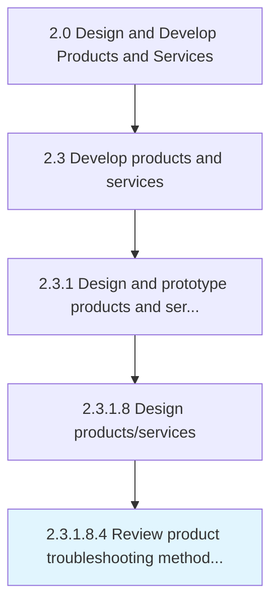
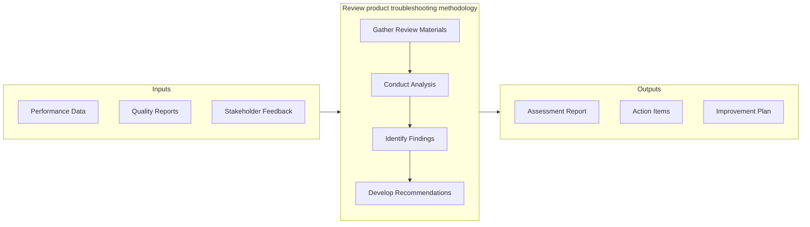

# Review product troubleshooting methodology

> Reviewing the design and approach for troubleshooting the product.

## Overview

Sub-Activity 2.3.1.8.4 is an activity within the Design and Develop Products and Services framework. 

Reviewing the design and approach for troubleshooting the product.

This activity contributes to the organization's product development objectives by executing defined processes within established quality and timeline parameters. It requires coordination across relevant functional teams and adherence to organizational standards. Outputs from this activity feed into downstream processes and contribute to overall product development success.

## Process Hierarchy



## Key Statistics

| Metric | Value |
|--------|-------|
| APQC Code | 16822 |
| Hierarchy ID | 2.3.1.8.4 |
| Level | Sub-Activity |
| Parent | [2.3.1.8](../) |
| Sub-Processes | 0 |


## GraphDL Semantic Structure

```
review.ProductTroubleshootingMethodology
```

| Component | Value | Description |
|-----------|-------|-------------|
| Verb | `review` | Primary action |
| Object | `product troubleshooting methodology` | Direct object |


## Related Concepts

- ProductTroubleshootingMethodology


## Process Flow



## RACI Matrix

| Activity | Responsible | Accountable | Consulted | Informed |
|----------|-------------|-------------|-----------|----------|
| Design and develop | Engineering Team | Engineering Manager | Product Manager | Quality Assurance |
| Test and validate | QA Engineer | Quality Manager | Product Designer | Product Manager |
| Approve and release | Engineering Manager | VP of Engineering | Operations | All Stakeholders |

## Related Occupations

- [Product Designer](/occupations/ArtsAndDesign/IndustrialDesigners) - Designs and prototypes product solutions
- [Engineering Manager](/occupations/Management/IndustrialProductionManagers) - Oversees development and production readiness
- [Quality Engineer](/occupations/Architecture/IndustrialEngineers) - Validates quality and reliability of prototypes
- [Supply Chain Analyst](/occupations/BusinessAndFinancial/LogisticsAnalysts) - Evaluates production and delivery feasibility

## Related Departments

- [Engineering](/departments/Engineering) - Designs, prototypes, and validates products
- [Operations](/departments/Operations) - Prepares production and service delivery processes
- [Quality Assurance](/departments/QualityAssurance) - Tests and validates product quality

## Industry Variations

### Manufacturing

Emphasizes physical product specifications, tooling requirements, and lean production principles in process execution.

### Technology

Focuses on agile development methodologies, continuous integration, and rapid iteration cycles with digital-first delivery.

### Healthcare

Requires adherence to patient safety standards, clinical efficacy validation, and comprehensive regulatory documentation.

## KPIs & Metrics

| Metric | Description | Target |
|--------|-------------|--------|
| Defect Rate | Percentage of defects identified per review cycle | < 2% |
| Review Cycle Time | Average time to complete review process | < 5 business days |
| First Pass Yield | Percentage of items passing review on first attempt | > 85% |

---

*Source: APQC PCF 16822 (2.3.1.8.4) - APQC*
