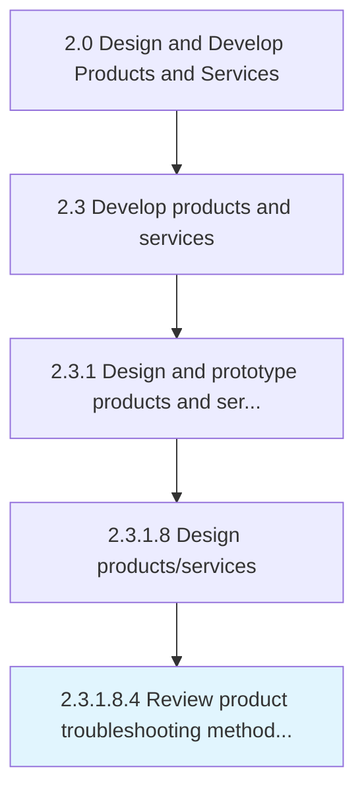

# Review product troubleshooting methodology

> Reviewing the design and approach for troubleshooting the product.

## Overview

Sub-Activity 2.3.1.8.4 is an activity within the Design and Develop Products and Services framework. 

Reviewing the design and approach for troubleshooting the product.

## Process Hierarchy



## Key Statistics

| Metric | Value |
|--------|-------|
| APQC Code | 16822 |
| Hierarchy ID | 2.3.1.8.4 |
| Level | Sub-Activity |
| Parent | [2.3.1.8](../) |
| Sub-Processes | 0 |


## GraphDL Semantic Structure

```
review.ProductTroubleshootingMethodology
```

| Component | Value | Description |
|-----------|-------|-------------|
| Verb | `review` | Primary action |
| Object | `product troubleshooting methodology` | Direct object |


## Related Concepts

- [ProductTroubleshootingMethodology](/concepts/ProductTroubleshootingMethodology)


---

*Source: APQC PCF 16822 (2.3.1.8.4) - APQC*
