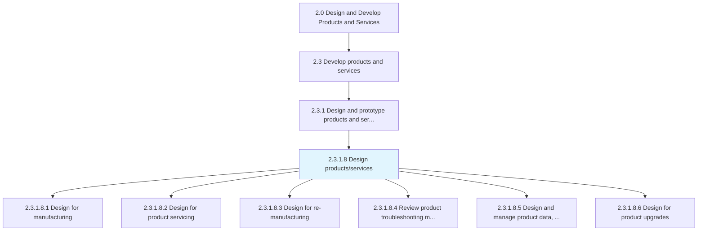
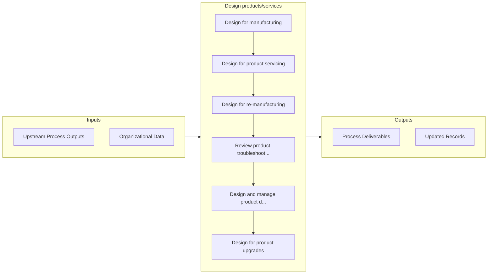

# Design products/services

> Creating a sketch of the customer focused product/service in Develop and Manage Products and Services [10003].

## Overview

Activity 2.3.1.8 is an activity within the Design and Develop Products and Services framework. 

Creating a sketch of the customer focused product/service in Develop and Manage Products and Services [10003].

## Process Hierarchy



## Key Statistics

| Metric | Value |
|--------|-------|
| APQC Code | 19995 |
| Hierarchy ID | 2.3.1.8 |
| Level | Activity |
| Parent | [2.3.1](../) |
| Sub-Processes | 6 |


## GraphDL Semantic Structure

```
design.Productsservices
```

| Component | Value | Description |
|-----------|-------|-------------|
| Verb | `design` | Primary action |
| Object | `products/services` | Direct object |


## Process Flow



## Sub-Processes

| Process | Hierarchy ID | Description |
|---------|-------------|-------------|
| [Design for manufacturing](./DesignForManufacturing) | 2.3.1.8.1 | Carrying out the steps necessary to appropriately manufacture correct parts |
| [Design for product servicing](./DesignForProductServicing) | 2.3.1.8.2 | Creating product application service view to allow for product servicing and refurbishing |
| [Design for re-manufacturing](./DesignForRemanufacturing) | 2.3.1.8.3 | Replacing core components and republishing |
| [Review product troubleshooting methodology](./ReviewProductTroubleshootingMethodology) | 2.3.1.8.4 | Reviewing the design and approach for troubleshooting the product |
| [Design and manage product data, design, and bill of materials](./DesignAndManageProductDataDesignAndBillOfMaterials) | 2.3.1.8.5 | Designing the BOM-Bill of material, manufacturing BOM and Service BOMA bill of materials list for al |
| [Design for product upgrades](./DesignForProductUpgrades) | 2.3.1.8.6 | Designing hardware and software upgrade techniques |


## Related Concepts

- [Products](/concepts/Products)
- [Services](/concepts/Services)


---

*Source: APQC PCF 19995 (2.3.1.8) - APQC*
