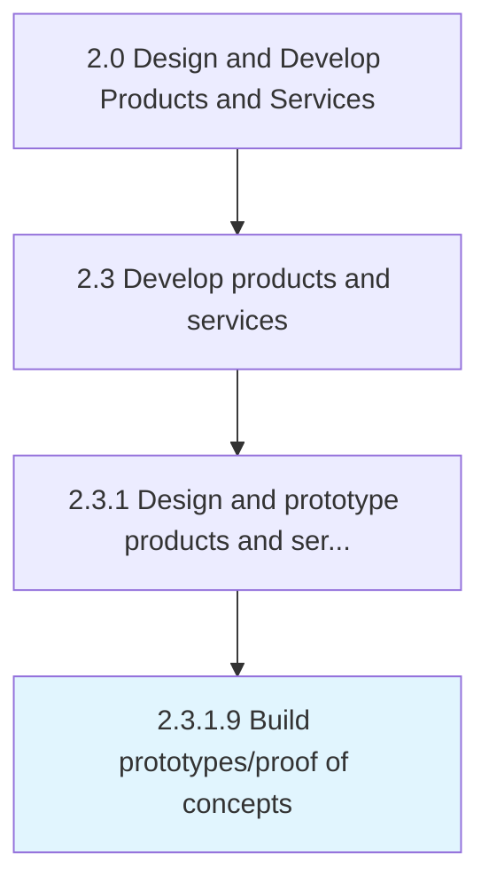
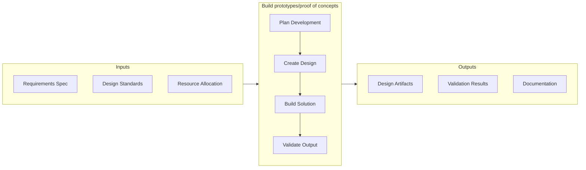

# Build prototypes/proof of concepts

> Building prototypes for shortlisted product/service concepts.

## Overview

Activity 2.3.1.9 is an activity within the Design and Develop Products and Services framework. 

Building prototypes for shortlisted product/service concepts. Develop prototypes for those product/service concepts that have been identified for further development. Provide proof-of-concepts, and test any processes involved. Build prototypes in line with the design specifications already outlined. Enlist the solutioning and/or design staff.

This activity translates conceptual requirements into tangible design artifacts or working prototypes that can be evaluated by stakeholders. It involves iterative design cycles, cross-functional feedback integration, and progressive refinement to ensure alignment with both technical specifications and user expectations. The outputs of this process serve as the foundation for subsequent validation, testing, and production readiness activities.

## Process Hierarchy



## Key Statistics

| Metric | Value |
|--------|-------|
| APQC Code | 10088 |
| Hierarchy ID | 2.3.1.9 |
| Level | Activity |
| Parent | [2.3.1](../) |
| Sub-Processes | 0 |


## GraphDL Semantic Structure

```graphdl
build.Prototypesproof.of.Concepts
```

| Component | Value | Description |
|-----------|-------|-------------|
| Verb | `build` | Primary action |
| Object | `prototypes/proof` | Direct object |
| Preposition | `of` | Relationship |
| PrepObject | `concepts` | Indirect object |


## Related Concepts

- Prototypes
- Concepts
- Proof
- Concepts


## Process Flow



## RACI Matrix

| Activity | Responsible | Accountable | Consulted | Informed |
|----------|-------------|-------------|-----------|----------|
| Design and develop | Engineering Team | Engineering Manager | Product Manager | Quality Assurance |
| Test and validate | QA Engineer | Quality Manager | Product Designer | Product Manager |
| Approve and release | Engineering Manager | VP of Engineering | Operations | All Stakeholders |

## Related Occupations

- [Product Designer](/occupations/ArtsAndDesign/IndustrialDesigners) - Designs and prototypes product solutions
- [Engineering Manager](/occupations/Management/IndustrialProductionManagers) - Oversees development and production readiness
- [Quality Engineer](/occupations/Architecture/IndustrialEngineers) - Validates quality and reliability of prototypes
- [Supply Chain Analyst](/occupations/BusinessAndFinancial/LogisticsAnalysts) - Evaluates production and delivery feasibility

## Related Departments

- [Engineering](/departments/Technology) - Designs, prototypes, and validates products
- [Operations](/departments/Operations) - Prepares production and service delivery processes
- Quality Assurance - Tests and validates product quality

## Industry Variations

### Automotive

Prototyping involves physical and digital twins, with extensive crash testing, emissions compliance, and supplier integration for component validation.

### Consumer Electronics

Rapid prototyping cycles with emphasis on miniaturization, user interface testing, and compatibility across device ecosystems.

### Healthcare

Prototypes must meet biocompatibility standards, undergo clinical validation, and comply with medical device regulations before production.

## KPIs & Metrics

| Metric | Description | Target |
|--------|-------------|--------|
| Time to Prototype | Duration from concept approval to working prototype | < 30 days |
| Design Iteration Count | Number of design revisions before approval | < 3 iterations |
| Specification Compliance | Percentage of design specs met by prototype | > 95% |

---

*Source: APQC PCF 10088 (2.3.1.9) - APQC*
