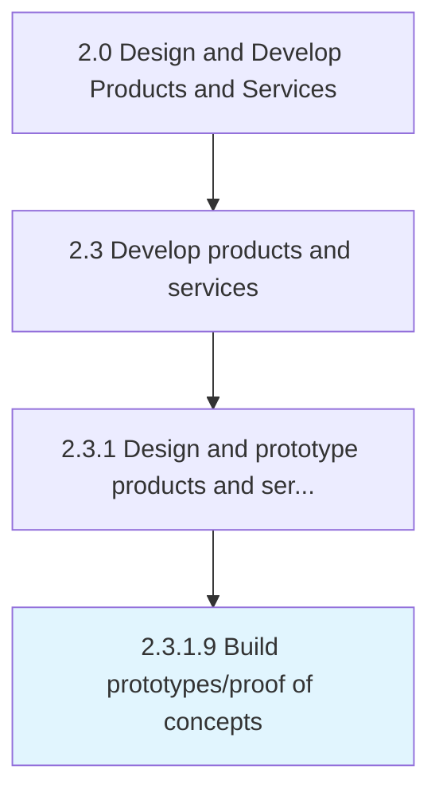

# Build prototypes/proof of concepts

> Building prototypes for shortlisted product/service concepts.

## Overview

Activity 2.3.1.9 is an activity within the Design and Develop Products and Services framework. 

Building prototypes for shortlisted product/service concepts. Develop prototypes for those product/service concepts that have been identified for further development. Provide proof-of-concepts, and test any processes involved. Build prototypes in line with the design specifications already outlined. Enlist the solutioning and/or design staff.

## Process Hierarchy



## Key Statistics

| Metric | Value |
|--------|-------|
| APQC Code | 10088 |
| Hierarchy ID | 2.3.1.9 |
| Level | Activity |
| Parent | [2.3.1](../) |
| Sub-Processes | 0 |


## GraphDL Semantic Structure

```
build.Prototypesproof.of.Concepts
```

| Component | Value | Description |
|-----------|-------|-------------|
| Verb | `build` | Primary action |
| Object | `prototypes/proof` | Direct object |
| Preposition | `of` | Relationship |
| PrepObject | `concepts` | Indirect object |


## Related Concepts

- Prototypes
- Concepts
- Proof
- Concepts


---

*Source: APQC PCF 10088 (2.3.1.9) - APQC*
