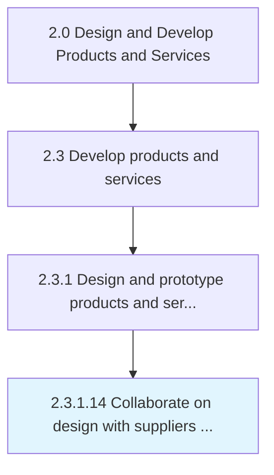

# Collaborate on design with suppliers and external partners

> Interacting with suppliers and manufactures to determine design decisions.

## Overview

Activity 2.3.1.14 is an activity within the Design and Develop Products and Services framework. 

Interacting with suppliers and manufactures to determine design decisions. Collaborate with vendors, suppliers, contractors, and subcontractors to verify feasibility of co-producing the prototype's design. Ensure that efforts can be coordinated with other stakeholders in the organization's supply chain ecosystem at the time of manufacturing, producing, or packaging the finished product/service.

## Process Hierarchy



## Key Statistics

| Metric | Value |
|--------|-------|
| APQC Code | 10092 |
| Hierarchy ID | 2.3.1.14 |
| Level | Activity |
| Parent | [2.3.1](../) |
| Sub-Processes | 0 |


## GraphDL Semantic Structure

```
collaborate.OnDesignWithSuppliersAndExternalPartners
```

| Component | Value | Description |
|-----------|-------|-------------|
| Verb | `collaborate` | Primary action |
| Object | `on design with suppliers and external partners` | Direct object |


## Related Concepts

- [DesignWithSuppliersPartners](/concepts/DesignWithSuppliersPartners)
- [DesignWithExternalPartners](/concepts/DesignWithExternalPartners)


---

*Source: APQC PCF 10092 (2.3.1.14) - APQC*
