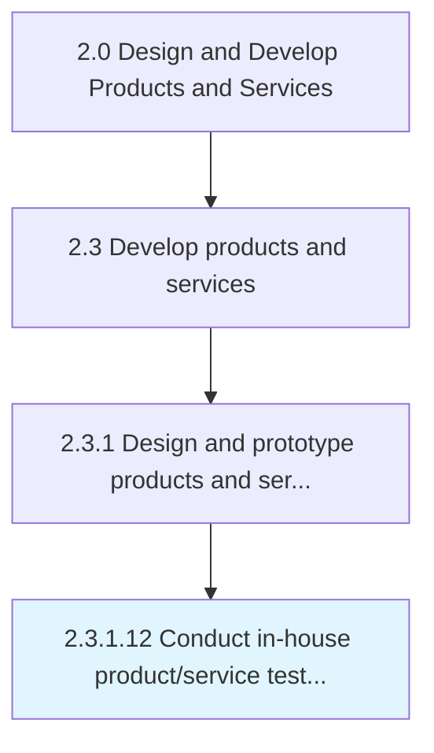
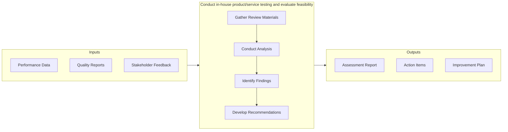

# Conduct in-house product/service testing and evaluate feasibility

> Carrying out an in-house appraisal of the prototypes in order to validate design and feasibility.

## Overview

Activity 2.3.1.12 is an activity within the Design and Develop Products and Services framework. 

Carrying out an in-house appraisal of the prototypes in order to validate design and feasibility. Test the product/service prototypes to confirm their compliance with design and usability standards. Corroborate the viability of the design, and validate the feasibility of their production. Identify any areas for improvement.

This activity is critical to ensuring that products and services meet established quality benchmarks before advancing through subsequent development stages. It involves systematic evaluation against predefined criteria, cross-functional collaboration to address identified gaps, and documentation of findings to support continuous improvement. The process draws on both quantitative metrics and qualitative assessments from subject matter experts.

## Process Hierarchy



## Key Statistics

| Metric | Value |
|--------|-------|
| APQC Code | 10090 |
| Hierarchy ID | 2.3.1.12 |
| Level | Activity |
| Parent | [2.3.1](../) |
| Sub-Processes | 0 |


## GraphDL Semantic Structure

```graphdl
conduct.InhouseProductserviceTestingAndEvaluateFeasibility
```

| Component | Value | Description |
|-----------|-------|-------------|
| Verb | `conduct` | Primary action |
| Object | `in-house product/service testing and evaluate feasibility` | Direct object |


## Process Flow



## RACI Matrix

| Activity | Responsible | Accountable | Consulted | Informed |
|----------|-------------|-------------|-----------|----------|
| Design and develop | Engineering Team | Engineering Manager | Product Manager | Quality Assurance |
| Test and validate | QA Engineer | Quality Manager | Product Designer | Product Manager |
| Approve and release | Engineering Manager | VP of Engineering | Operations | All Stakeholders |

## Related Occupations

- [Product Designer](/occupations/ArtsAndDesign/IndustrialDesigners) - Designs and prototypes product solutions
- [Engineering Manager](/occupations/Management/IndustrialProductionManagers) - Oversees development and production readiness
- [Quality Engineer](/occupations/Architecture/IndustrialEngineers) - Validates quality and reliability of prototypes
- [Supply Chain Analyst](/occupations/BusinessAndFinancial/LogisticsAnalysts) - Evaluates production and delivery feasibility
- [Test Engineer](/occupations/Computer/SoftwareQualityAssurance) - Conducts product testing and validation

## Related Departments

- [Engineering](/departments/Technology) - Designs, prototypes, and validates products
- [Operations](/departments/Operations) - Prepares production and service delivery processes
- Quality Assurance - Tests and validates product quality

## Industry Variations

### Manufacturing

Emphasizes physical product specifications, tooling requirements, and lean production principles in process execution.

### Technology

Focuses on agile development methodologies, continuous integration, and rapid iteration cycles with digital-first delivery.

### Healthcare

Requires adherence to patient safety standards, clinical efficacy validation, and comprehensive regulatory documentation.

## KPIs & Metrics

| Metric | Description | Target |
|--------|-------------|--------|
| Defect Rate | Percentage of defects identified per review cycle | < 2% |
| Review Cycle Time | Average time to complete review process | < 5 business days |
| First Pass Yield | Percentage of items passing review on first attempt | > 85% |

---

*Source: APQC PCF 10090 (2.3.1.12) - APQC*
