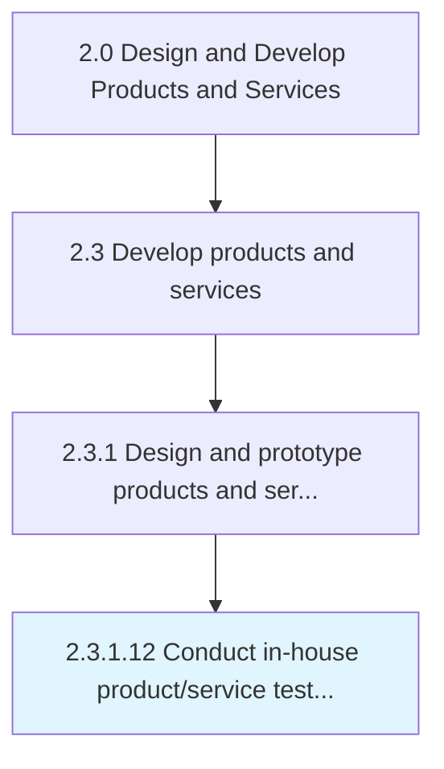

# Conduct in-house product/service testing and evaluate feasibility

> Carrying out an in-house appraisal of the prototypes in order to validate design and feasibility.

## Overview

Activity 2.3.1.12 is an activity within the Design and Develop Products and Services framework. 

Carrying out an in-house appraisal of the prototypes in order to validate design and feasibility. Test the product/service prototypes to confirm their compliance with design and usability standards. Corroborate the viability of the design, and validate the feasibility of their production. Identify any areas for improvement.

## Process Hierarchy



## Key Statistics

| Metric | Value |
|--------|-------|
| APQC Code | 10090 |
| Hierarchy ID | 2.3.1.12 |
| Level | Activity |
| Parent | [2.3.1](../) |
| Sub-Processes | 0 |


## GraphDL Semantic Structure

```
conduct.InhouseProductserviceTestingAndEvaluateFeasibility
```

| Component | Value | Description |
|-----------|-------|-------------|
| Verb | `conduct` | Primary action |
| Object | `in-house product/service testing and evaluate feasibility` | Direct object |


---

*Source: APQC PCF 10090 (2.3.1.12) - APQC*
