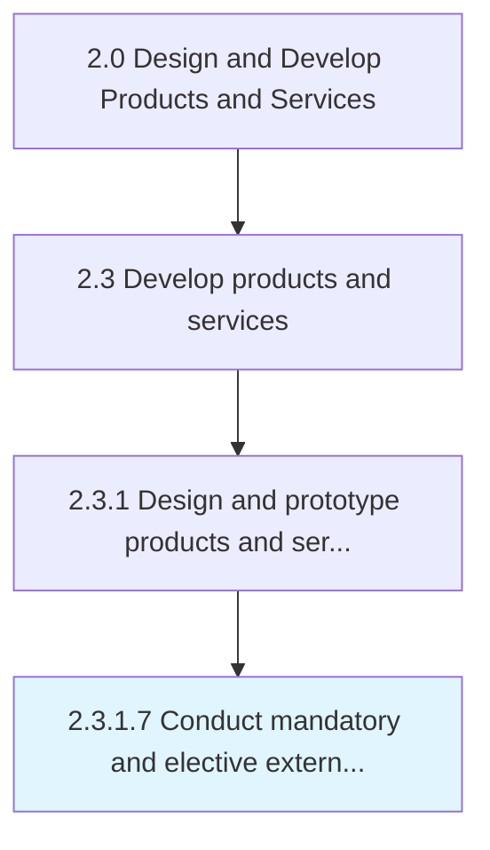

# Conduct mandatory and elective external reviews

> Conducting any mandatory and elective appraisals of the product/service design specifications in order to ensure compliance with external standards.

## Overview

Activity 2.3.1.7 is an activity within the Design and Develop Products and Services framework. 

Conducting any mandatory and elective appraisals of the product/service design specifications in order to ensure compliance with external standards. Carry out external reviews of specifications created for the development of new product/service designs. Conduct mandatory appraisals such as legal and regulatory, as well as any optional assessments that, for instance, pitch the specifications against industrial benchmarks.

## Process Hierarchy



## Key Statistics

| Metric | Value |
|--------|-------|
| APQC Code | 10087 |
| Hierarchy ID | 2.3.1.7 |
| Level | Activity |
| Parent | [2.3.1](../) |
| Sub-Processes | 0 |


## GraphDL Semantic Structure

```
conduct.MandatoryAndElectiveExternalReviews
```

| Component | Value | Description |
|-----------|-------|-------------|
| Verb | `conduct` | Primary action |
| Object | `mandatory and elective external reviews` | Direct object |


## Related Concepts

- [MandatoryExternalReviews](/concepts/MandatoryExternalReviews)
- [ElectiveExternalReviews](/concepts/ElectiveExternalReviews)


---

*Source: APQC PCF 10087 (2.3.1.7) - APQC*
