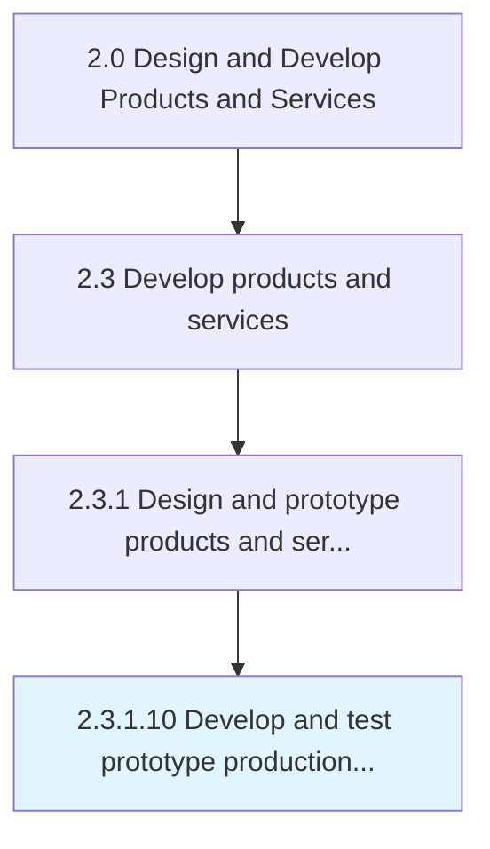

# Develop and test prototype production and/or service delivery process

> Creating the new manufacturing/delivery processes for the new products/services, and testing them to ensure proper functioning.

## Overview

Activity 2.3.1.10 is an activity within the Design and Develop Products and Services framework. 

Creating the new manufacturing/delivery processes for the new products/services, and testing them to ensure proper functioning. Create the production/delivery process for the prototypes that have been built for the new products/services. Conduct trial-runs to test these processes and their integration with the organization's other processes.

## Process Hierarchy



## Key Statistics

| Metric | Value |
|--------|-------|
| APQC Code | 10098 |
| Hierarchy ID | 2.3.1.10 |
| Level | Activity |
| Parent | [2.3.1](../) |
| Sub-Processes | 0 |


## GraphDL Semantic Structure

```
develop.AndTestPrototypeProductionAndorServiceDeliveryProcess
```

| Component | Value | Description |
|-----------|-------|-------------|
| Verb | `develop` | Primary action |
| Object | `and test prototype production and/or service delivery process` | Direct object |


## Related Concepts

- [PrototypeProduction/ServiceDeliveryProcess](/concepts/PrototypeProduction/ServiceDeliveryProcess)
- [PrototypeProduction/ServiceDeliveryProcess](/concepts/PrototypeProduction/ServiceDeliveryProcess)


---

*Source: APQC PCF 10098 (2.3.1.10) - APQC*
