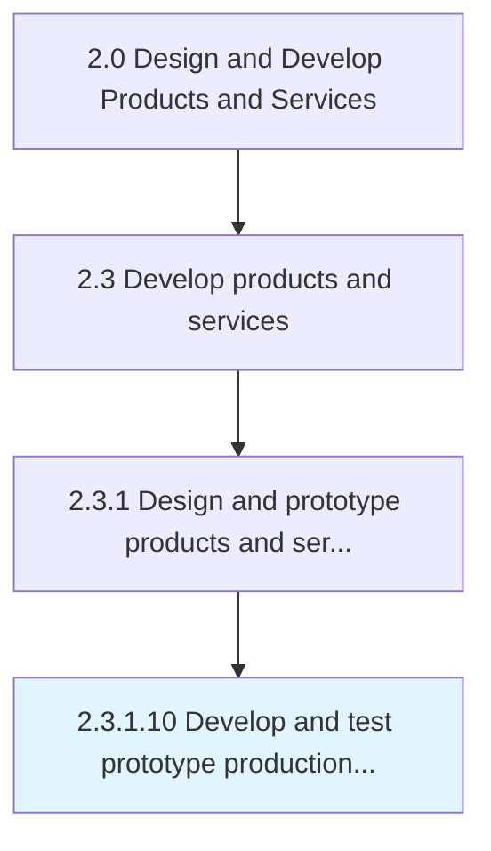
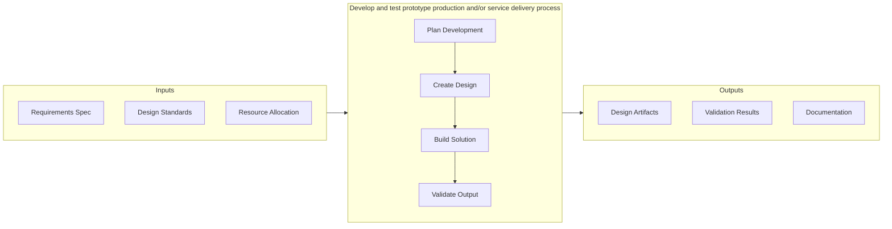

# Develop and test prototype production and/or service delivery process

> Creating the new manufacturing/delivery processes for the new products/services, and testing them to ensure proper functioning.

## Overview

Activity 2.3.1.10 is an activity within the Design and Develop Products and Services framework. 

Creating the new manufacturing/delivery processes for the new products/services, and testing them to ensure proper functioning. Create the production/delivery process for the prototypes that have been built for the new products/services. Conduct trial-runs to test these processes and their integration with the organization's other processes.

This activity is critical to ensuring that products and services meet established quality benchmarks before advancing through subsequent development stages. It involves systematic evaluation against predefined criteria, cross-functional collaboration to address identified gaps, and documentation of findings to support continuous improvement. The process draws on both quantitative metrics and qualitative assessments from subject matter experts.

## Process Hierarchy



## Key Statistics

| Metric | Value |
|--------|-------|
| APQC Code | 10098 |
| Hierarchy ID | 2.3.1.10 |
| Level | Activity |
| Parent | [2.3.1](../) |
| Sub-Processes | 0 |


## GraphDL Semantic Structure

```
develop.AndTestPrototypeProductionAndorServiceDeliveryProcess
```

| Component | Value | Description |
|-----------|-------|-------------|
| Verb | `develop` | Primary action |
| Object | `and test prototype production and/or service delivery process` | Direct object |


## Related Concepts

- PrototypeProduction/ServiceDeliveryProcess
- PrototypeProduction/ServiceDeliveryProcess


## Process Flow



## RACI Matrix

| Activity | Responsible | Accountable | Consulted | Informed |
|----------|-------------|-------------|-----------|----------|
| Design and develop | Engineering Team | Engineering Manager | Product Manager | Quality Assurance |
| Test and validate | QA Engineer | Quality Manager | Product Designer | Product Manager |
| Approve and release | Engineering Manager | VP of Engineering | Operations | All Stakeholders |

## Related Occupations

- [Product Designer](/occupations/ArtsAndDesign/IndustrialDesigners) - Designs and prototypes product solutions
- [Engineering Manager](/occupations/Management/IndustrialProductionManagers) - Oversees development and production readiness
- [Quality Engineer](/occupations/Architecture/IndustrialEngineers) - Validates quality and reliability of prototypes
- [Supply Chain Analyst](/occupations/BusinessAndFinancial/LogisticsAnalysts) - Evaluates production and delivery feasibility
- [Test Engineer](/occupations/Computer/SoftwareQualityAssurance) - Conducts product testing and validation

## Related Departments

- [Engineering](/departments/Engineering) - Designs, prototypes, and validates products
- [Operations](/departments/Operations) - Prepares production and service delivery processes
- [Quality Assurance](/departments/QualityAssurance) - Tests and validates product quality

## Industry Variations

### Automotive

Prototyping involves physical and digital twins, with extensive crash testing, emissions compliance, and supplier integration for component validation.

### Consumer Electronics

Rapid prototyping cycles with emphasis on miniaturization, user interface testing, and compatibility across device ecosystems.

### Healthcare

Prototypes must meet biocompatibility standards, undergo clinical validation, and comply with medical device regulations before production.

## KPIs & Metrics

| Metric | Description | Target |
|--------|-------------|--------|
| Defect Rate | Percentage of defects identified per review cycle | < 2% |
| Review Cycle Time | Average time to complete review process | < 5 business days |
| First Pass Yield | Percentage of items passing review on first attempt | > 85% |

---

*Source: APQC PCF 10098 (2.3.1.10) - APQC*
