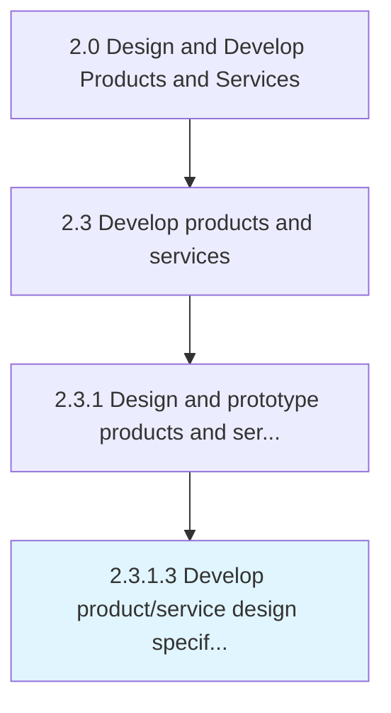

# Develop product/service design specifications

> Creating design specifications.

## Overview

Activity 2.3.1.3 is an activity within the Design and Develop Products and Services framework. 

Creating design specifications. Create specifications for the design of new or revised product/service concepts as a measure to meet during development. Have the senior functional-level solutioning or design staff create a framework of compliance standards for these products/services.

## Process Hierarchy



## Key Statistics

| Metric | Value |
|--------|-------|
| APQC Code | 10085 |
| Hierarchy ID | 2.3.1.3 |
| Level | Activity |
| Parent | [2.3.1](../) |
| Sub-Processes | 0 |


## GraphDL Semantic Structure

```
develop.ProductserviceDesignSpecifications
```

| Component | Value | Description |
|-----------|-------|-------------|
| Verb | `develop` | Primary action |
| Object | `product/service design specifications` | Direct object |


## Related Concepts

- [ProductDesignSpecifications](/concepts/ProductDesignSpecifications)
- [ServiceDesignSpecifications](/concepts/ServiceDesignSpecifications)


---

*Source: APQC PCF 10085 (2.3.1.3) - APQC*
