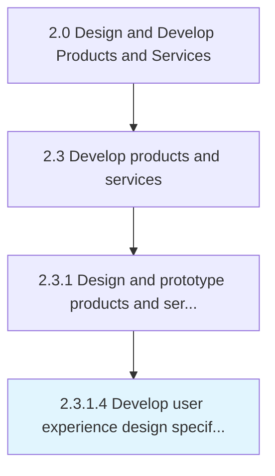

# Develop user experience design specifications

> Determining the usability and user experience of products and the business impact it creates.

## Overview

Activity 2.3.1.4 is an activity within the Design and Develop Products and Services framework. 

Determining the usability and user experience of products and the business impact it creates.

## Process Hierarchy



## Key Statistics

| Metric | Value |
|--------|-------|
| APQC Code | 16813 |
| Hierarchy ID | 2.3.1.4 |
| Level | Activity |
| Parent | [2.3.1](../) |
| Sub-Processes | 0 |


## GraphDL Semantic Structure

```
develop.UserExperienceDesignSpecifications
```

| Component | Value | Description |
|-----------|-------|-------------|
| Verb | `develop` | Primary action |
| Object | `user experience design specifications` | Direct object |


## Related Concepts

- [UserExperienceDesignSpecifications](/concepts/UserExperienceDesignSpecifications)


---

*Source: APQC PCF 16813 (2.3.1.4) - APQC*
