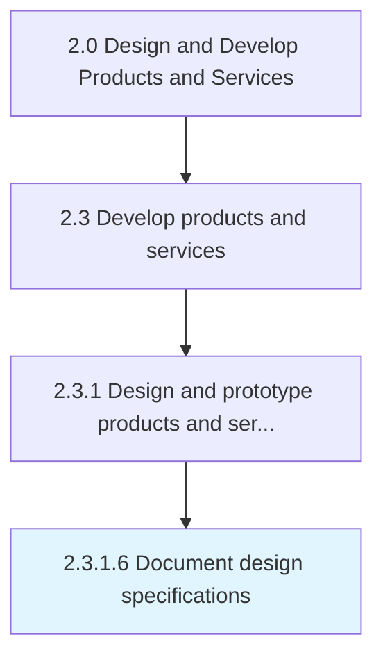

# Document design specifications

> Documenting requirements to meet in the design of new or revised products/services.

## Overview

Activity 2.3.1.6 is an activity within the Design and Develop Products and Services framework. 

Documenting requirements to meet in the design of new or revised products/services. Specify technical, quality, and costing requirements, as well as ergonomic, safety, and servicing requirements for such products/services. Ensure the information presented can be understood by the personnel executing the design and includes examples, anecdotal references, and illustrations.

## Process Hierarchy



## Key Statistics

| Metric | Value |
|--------|-------|
| APQC Code | 10086 |
| Hierarchy ID | 2.3.1.6 |
| Level | Activity |
| Parent | [2.3.1](../) |
| Sub-Processes | 0 |


## GraphDL Semantic Structure

```
document.DesignSpecifications
```

| Component | Value | Description |
|-----------|-------|-------------|
| Verb | `document` | Primary action |
| Object | `design specifications` | Direct object |


## Related Concepts

- DesignSpecifications


---

*Source: APQC PCF 10086 (2.3.1.6) - APQC*
