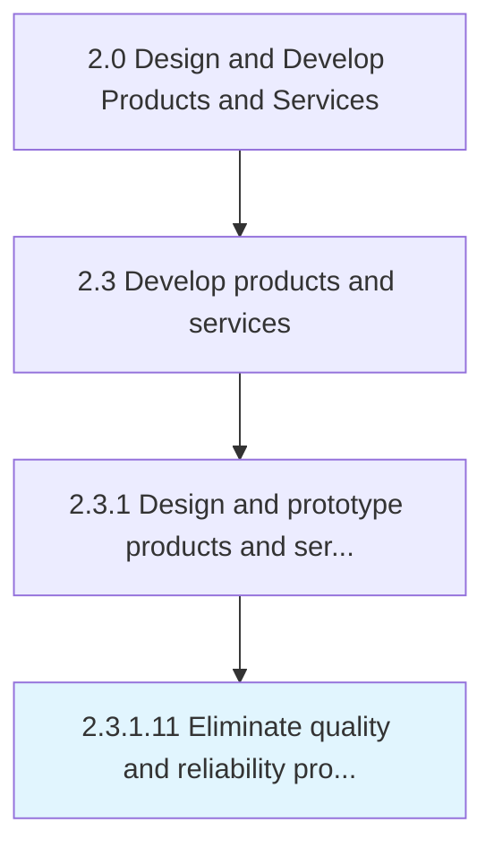

# Eliminate quality and reliability problems

> Eliminating any problems relating to utility of the product/service over the course of its expected lifetime.

## Overview

Activity 2.3.1.11 is an activity within the Design and Develop Products and Services framework. 

Eliminating any problems relating to utility of the product/service over the course of its expected lifetime. Tweak the prototype in order to comply with the required quality and reliability standards. Further refine the prototype, so it may be subjected to testing.

## Process Hierarchy



## Key Statistics

| Metric | Value |
|--------|-------|
| APQC Code | 10089 |
| Hierarchy ID | 2.3.1.11 |
| Level | Activity |
| Parent | [2.3.1](../) |
| Sub-Processes | 0 |


## GraphDL Semantic Structure

```
eliminate.QualityAndReliabilityProblems
```

| Component | Value | Description |
|-----------|-------|-------------|
| Verb | `eliminate` | Primary action |
| Object | `quality and reliability problems` | Direct object |


## Related Concepts

- QualityProblems
- ReliabilityProblems


---

*Source: APQC PCF 10089 (2.3.1.11) - APQC*
