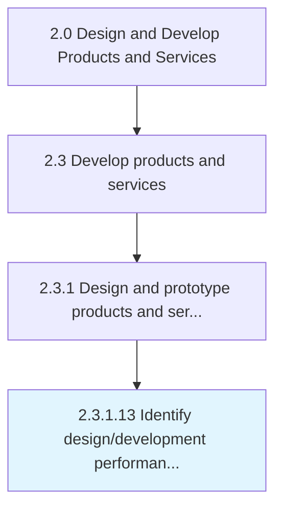

# Identify design/development performance indicators

> Identifying performance parameters.

## Overview

Activity 2.3.1.13 is an activity within the Design and Develop Products and Services framework. 

Identifying performance parameters. Determine the parameters to measure performance of the design and development of the product/service concepts into prototypes.

## Process Hierarchy



## Key Statistics

| Metric | Value |
|--------|-------|
| APQC Code | 10091 |
| Hierarchy ID | 2.3.1.13 |
| Level | Activity |
| Parent | [2.3.1](../) |
| Sub-Processes | 0 |


## GraphDL Semantic Structure

```
identify.DesigndevelopmentPerformanceIndicators
```

| Component | Value | Description |
|-----------|-------|-------------|
| Verb | `identify` | Primary action |
| Object | `design/development performance indicators` | Direct object |


## Related Concepts

- [DesignPerformanceIndicators](/concepts/DesignPerformanceIndicators)
- [DevelopmentPerformanceIndicators](/concepts/DevelopmentPerformanceIndicators)


---

*Source: APQC PCF 10091 (2.3.1.13) - APQC*
