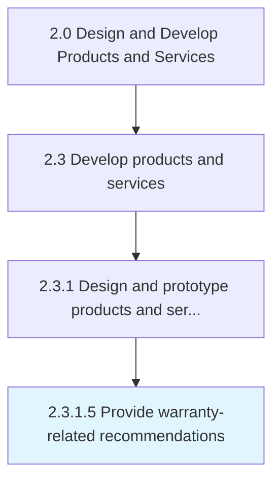

# Provide warranty-related recommendations

> Providing warranty plan and pricing specifications for recommendation.

## Overview

Activity 2.3.1.5 is an activity within the Design and Develop Products and Services framework. 

Providing warranty plan and pricing specifications for recommendation.

## Process Hierarchy



## Key Statistics

| Metric | Value |
|--------|-------|
| APQC Code | 16817 |
| Hierarchy ID | 2.3.1.5 |
| Level | Activity |
| Parent | [2.3.1](../) |
| Sub-Processes | 0 |


## GraphDL Semantic Structure

```
provide.WarrantyrelatedRecommendations
```

| Component | Value | Description |
|-----------|-------|-------------|
| Verb | `provide` | Primary action |
| Object | `warranty-related recommendations` | Direct object |


---

*Source: APQC PCF 16817 (2.3.1.5) - APQC*
